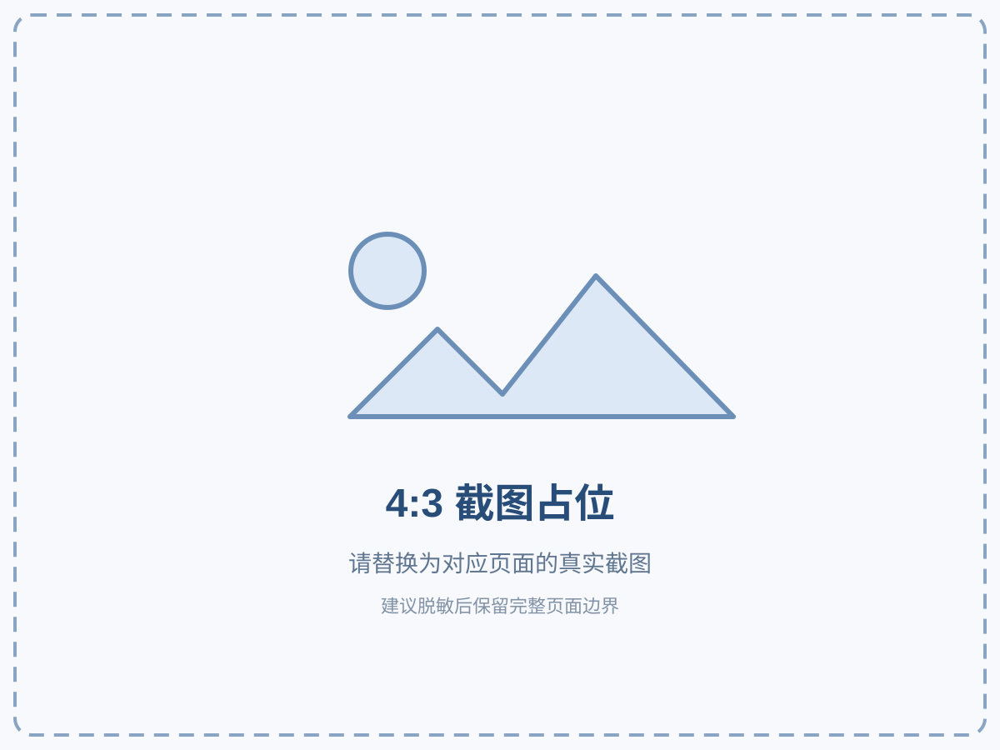

# 苏南船舶管理系统操作手册

## 1. 文档说明

### 1.1 手册定位

本手册是苏南船舶管理系统当前生产版本的用户操作依据，面向企业微信 H5 中的普通员工、业务经办人、审批人、船员、部门管理人员、安全管理人员和系统管理员。

| 项目 | 当前口径 |
|---|---|
| 系统版本 | 0.0.5 |
| 核对日期 | 2026 年 8 月 10 日 |
| 主要运行容器 | 企业微信 H5 |
| 一级板块 | 我的、办事、采购管理、工作平台 |
| 安全管理入口 | 工作平台内的安全主数据、计划、任务、检查、问题和 CAPA |
| 不纳入本手册 | 外部 AIS/CCTV/海事监管系统内部操作 |

本手册按照“实际前端页面和后端权限 > 当前领域规格 > 需求文档 > 历史验收与参考资料”的顺序核对。历史 PC/小程序操作手册和平台功能对比文档只作参考，不代表苏南系统当前页面已经具备其中全部功能。

### 1.2 企业微信使用原则

企业微信是本系统的主要运行入口，不是附加登录方式。用户可能从以下任一位置直接进入业务：

- 企业微信工作台应用
- 企业微信任务消息
- 企业微信审批页或审批通知
- 管理员发送的系统内记录链接
- 工作平台快捷入口

系统不要求用户先进入“我的”首页再逐层导航。直接打开任务、采购单、检查或问题链接时，系统应先恢复认证，再返回原目标页面。

### 1.3 当前功能边界

使用前应了解以下边界：

1. 本系统是企业微信 H5，不是微信小程序。
2. 页面是否显示按钮以及按钮能否执行，由角色、部门、船舶范围、记录参与关系和记录状态共同决定。
3. 采购单与采购报表当前默认使用系统内审批；企业微信原生审批只在明确启用的工作平台业务中使用。
4. 安全主数据 H5 当前以查询和受控选择为主，普通用户不能在页面中直接新建或编辑船舶、人员和设备档案。
5. 检查模板页面可创建包含首个检查项的草稿，但当前 H5 没有模板发布按钮；发布或复杂版本治理按管理员流程处理。
6. 检查计划页面当前按一次性、全部完成、60 分钟办理时限创建；更复杂的周期规则使用通用安全计划管理。
7. 工作平台动态表单的字段能力因模块而异。法律法规或公司制度要求的信息不能因为页面暂时没有专用字段而省略，应通过说明、附件或现行线下流程补足。
8. 证据解除、替换、任务转移、代理、取消、退役、审批和关闭均会留痕，不应通过重复新建来规避历史。

### 1.4 图片占位说明

文中的 4:3 图片是正式截图占位。补图时可直接替换图片文件；Word 版可右键占位图选择“更改图片”，保持原有尺寸和位置。补图时应：

- 使用当前生产版本的真实页面；
- 用序号、方框或箭头标出点击位置；
- 隐藏手机号、证件号码、采购金额、审批意见、附件内容和企业微信成员标识等敏感信息；
- 同一流程尽量使用同一业务编号，方便前后对照；
- 分别记录桌面端和企业微信手机端差异；
- 不使用 mock、演示数据或未上线功能截图冒充生产能力。

一个操作需要多张截图时使用字母子图，例如“图 7-4A、图 7-4B、图 7-4C”。每张子图都保持完整 4:3，不拼接、不裁成窄长图，并按实际操作顺序排列。

*图 1-1 4:3 截图占位示例。替换时保留图号，并把替代文字改为真实页面名称。*

### 1.5 快速查阅方式

| 想完成的事项 | 建议先看 |
|---|---|
| 第一次进入系统 | 第 3 章 |
| 上传、预览或解除附件 | 第 4.5 节 |
| 查看证照和到期提醒 | 第 5.4 至 5.5 节 |
| 打开办事入口 | 第 6.1 至 6.2 节 |
| 新建采购单 | 第 7.3 节 |
| 审批采购单或报表 | 第 7.6、7.9 节 |
| 管理采购预算 | 第 7.10 节 |
| 新建工作平台记录 | 第 8.4 节 |
| 查看安全待办或日历 | 第 9.4 节 |
| 执行现场检查 | 第 9.8 节 |
| 完成 CAPA 措施 | 第 9.10 节 |
| 验证、返工和关闭问题 | 第 9.11 至 9.12 节 |
| 页面报错或无权限 | 第 13 章 |

## 2. 角色、数据范围与职责

### 2.1 常见角色

业务角色主要来自企业微信通讯录中的部门归属；系统管理员由独立管理员名单判定，不会因为加入某个部门自动获得。职务只用于兼容少量既有船员身份。一个用户同时属于多个业务部门时，系统合并其角色和数据范围并去重。

| 页面显示角色 | 典型人员 | 主要使用范围 |
|---|---|---|
| 系统管理员 | 企业微信通讯录或系统管理员 | 全平台配置、跨范围治理、异常处理、审批对账 |
| 总经办 | 总经办成员 | 总经办模块、办事治理、采购终审、部分全局查询 |
| 财务部 | 财务部成员 | 财务工作平台、采购报表财务审批、财务业务 |
| 业务部 | 业务部成员 | 业务工作平台、船舶动态和作业流程 |
| 船务部 | 船务部成员 | 船务工作平台、安全检查、航次、设备和燃油业务 |
| 后勤部 | 后勤部成员 | 仓库、办公、食堂、宿舍、车辆等后勤业务 |
| 船员 | 船员、船长等岗位 | 本人、本船或本人参与的船务记录与任务 |
| 全体成员 | 所有已认证用户 | 被授权的“我的”、办事入口和本人相关数据 |

安全领域还使用执行人、协作人、审核人、验证人、观察人和代理人等记录级参与角色。它们不是全局系统角色，只对具体任务、检查、问题或 CAPA 生效。

页面中的用户身份优先显示企业微信头像；头像缺失或加载失败时显示姓名首字。多部门成员的具体部门名称以“ / ”分隔，组织根部门和“待设置部门”不会在已有具体部门时重复显示。

### 2.2 数据范围原则

- 列表只返回当前用户有权读取的记录。
- 船员通常只能查看本人、本船或本人参与的记录。
- 部门人员通常只能查看本部门或被分派范围。
- 计划负责人可以管理本人负责的计划；系统管理员可按授权跨范围处理。
- 转移后的原责任人保留历史轨迹，但不再拥有执行按钮。
- 代理人只在代理有效期内获得执行权，责任人并不会因此被替换。
- CAPA 验证人不能是任一有效措施的责任人。
- 没有读取权限时，错误页不应展示标题、人员、期限、附件或消息元数据。

### 2.3 按钮与权限

看到页面不等于拥有全部操作权限：

- 新增、编辑、发布、删除、停用、审批、打印、导出、关闭等按钮可能因账号不同而不同。
- 前端不显示按钮时，不应通过手工拼接接口或修改地址绕过。
- 按钮点击后仍可能因为记录状态变化返回权限或状态冲突。
- 发现权限过大、他船数据可见、职责冲突或按钮与岗位不符时，应立即停止处理并联系管理员。

### 2.4 高风险职责分离

以下操作必须由不同职责人员完成：

| 场景 | 不允许的组合 |
|---|---|
| CAPA 措施与验证 | 措施责任人验证本人措施 |
| 普通执行与问题关闭 | 普通执行人直接关闭重大或严重问题 |
| 采购申请与审批 | 无审批角色的申请人自行通过审批 |
| 任务转移 | 将任务转移给同一负责人或无效人员 |
| 证据维护 | 静默替换或物理删除已归档证据 |

## 3. 登录、直达与导航

### 3.1 从企业微信工作台进入

1. 打开企业微信。
2. 进入“工作台”。
3. 点击苏南船舶管理系统应用或目标业务应用。
4. 系统检查本地会话。
5. 会话有效时直接进入目标页；会话无效时自动跳转企业微信静默授权。
6. 授权完成后核对页面左上标题、当前用户和角色。

*图 3-1A 企业微信工作台入口。截图应包含应用名称和图标。*

*图 3-1B 企业微信授权中页面。截图应包含企业微信环境提示和加载状态。*

*图 3-1C 授权完成后的系统首页。截图应标注头像、姓名、角色和主要入口。*

### 3.2 从消息或链接直达

任务消息、审批通知或业务链接可能直接打开详情页。进入后先核对：

- 页面标题和业务编号；
- 船舶、部门或业务范围；
- 当前状态和截止时间；
- 当前负责人、参与人或审批节点；
- 页面上实际出现的可执行按钮。

若认证过期，系统会保存安全的站内目标路径，完成认证后返回原页面。外部地址、双斜杠地址或异常跳转目标会被系统降级到“我的”首页。

### 3.3 重新认证

桌面端顶部和移动端导航抽屉提供“重新认证”。

出现以下情况时可使用：

- 企业微信部门或岗位刚发生变化；
- 页面持续提示登录失效；
- 角色与当前岗位不一致；
- 企业微信账号切换；
- 深链打开后返回错误身份。

操作步骤：

1. 记录当前业务编号和页面地址。
2. 点击“重新认证”。
3. 等待企业微信授权完成。
4. 返回原页面后重新读取记录状态。
5. 不要在状态未确认前重复提交。

### 3.4 桌面端导航

桌面端左侧按四个一级板块分组：

- 我的
- 办事中心
- 采购管理
- 工作平台

点击分组可展开二级入口；侧边栏可收起。当前页面会高亮。详情页通常保留所属板块高亮，使用浏览器返回或页面返回按钮回到上一级。

### 3.5 移动端导航

移动端底部固定显示四个一级板块。右上角优先显示企业微信头像，点击后打开“更多”导航抽屉；头像不可用时显示姓名首字。抽屉中可查看当前用户、角色、各板块二级入口并重新认证。

移动端建议：

- 完成当前任务后再切换板块；
- 不在多个企业微信窗口同时编辑同一记录；
- 表格可在表格区域横向滑动，页面整体不应横向滚动；
- 详情页优先从消息或待办直达，减少多层返回。

*图 3-2A 桌面侧边导航。截图应包含四个一级板块、二级入口和重新认证。*

*图 3-2B 移动底部导航。截图应包含当前板块高亮和右上角用户头像。*

*图 3-2C 移动“更多”抽屉。截图应包含用户身份、角色、二级入口和重新认证。*

### 3.6 当前主要路由地图

此表主要供培训、支持和排障使用，普通用户不需要手工输入带参数的地址。

| 板块 | 页面 | 路径 |
|---|---|---|
| 我的 | 首页 | /my |
| 我的 | 企业资料 | /my/enterprise-profile |
| 我的 | 企业制度 | /my/enterprise-policy |
| 我的 | 电子证照 | /my/certificates |
| 我的 | 证书提醒 | /my/reminders |
| 我的 | 船舶监控 | /my/monitors |
| 我的 | 设置 | /my/settings |
| 办事 | 首页 | /office |
| 办事 | 搜索 | /office/search |
| 办事 | 治理台 | /office/admin |
| 采购 | 采购单列表 | /procurement |
| 采购 | 新建采购单 | /procurement/orders/new |
| 采购 | 采购审批 | /procurement/approvals |
| 采购 | 采购报表 | /procurement/reports |
| 采购 | 报表审批 | /procurement/report-approvals |
| 采购 | 字典治理 | /procurement/dictionaries |
| 采购 | 年度预算 | /procurement/budgets |
| 工作平台 | 首页 | /workbench |
| 工作平台 | 安全主数据 | /workbench/master-data |
| 工作平台 | 安全任务中心 | /workbench/tasks |
| 工作平台 | 安全计划管理 | /workbench/plans |
| 工作平台 | 检查模板 | /workbench/inspection-templates |
| 工作平台 | 检查计划 | /workbench/inspection-plans |
| 工作平台 | 现场检查 | /workbench/inspections |
| 工作平台 | 安全问题中心 | /workbench/issues |
| 工作平台 | 考勤统计 | /workbench/statistics/attendance |
| 工作平台 | 审批看板 | /workbench/approvals |

## 4. 通用操作

### 4.1 页面加载、空态与错误态

| 页面反馈 | 含义 | 建议操作 |
|---|---|---|
| 加载中、骨架或转圈 | 正在读取服务端数据 | 等待完成，不重复刷新 |
| 暂无数据 | 当前权限和筛选下没有记录 | 清空筛选，再确认数据范围 |
| 加载失败，请重试 | 网络或服务异常 | 保留业务信息，重试一次 |
| 无权访问或记录不存在 | 可能是权限不足，也可能是资源无效 | 核对账号和链接，联系管理员 |
| 状态冲突 | 记录已被他人处理或不允许当前动作 | 刷新详情后按新状态操作 |
| 参数或前置条件不满足 | 必填、职责、日期或闭环门槛不合法 | 按页面提示补全，不重复创建 |

### 4.2 查询、筛选与分页

常见查询方式包括：

- 关键字搜索；
- 状态筛选；
- 分类、部门、船舶或对象筛选；
- 日期范围筛选；
- 列表分页；
- 看板卡片下钻；
- 列表和日历切换。

桌面端查询、筛选和同行表单控件通常横向排列；空间不足会自动换行。移动端多数改为单列，主要按钮可能铺满可用宽度。按钮换行不代表功能缺失，应上下滚动查看完整工具栏。

推荐步骤：

1. 先选择业务范围或部门。
2. 再选择状态和日期。
3. 最后输入标题、摘要或编号关键字。
4. 无结果时清空全部筛选。
5. 检查是否超出近 3 年等业务查询限制。

系统部分列表会把筛选条件保存在地址中，从详情返回时可恢复列表状态和滚动位置。

### 4.3 新建、保存与提交

“保存”和“提交”含义不同：

| 按钮 | 常见含义 |
|---|---|
| 新建、创建草稿 | 生成可继续编辑的记录 |
| 保存 | 保存当前字段，不一定进入流程 |
| 保存草稿 | 保留未提交记录 |
| 保存并提交、提交审批 | 保存后进入审批或流程 |
| 完成步骤 | 推进当前工作平台步骤 |
| 提交审核 | 全部执行步骤完成后进入复核 |
| 汇总检查 | 多人检查达到门槛后生成汇总结论 |
| 提交验证 | CAPA 全部必要措施接受后进入验证 |
| 验证关闭 | 验证通过且关闭门槛满足后关闭问题 |

提交前应核对：

- 部门、船舶、对象和责任人；
- 业务日期、计划时间和截止时间；
- 必填字段；
- 附件或现场证据；
- 当前状态；
- 是否会进入系统内审批或企业微信审批。

提交按钮显示加载时不要连续点击。失败后应在原记录中重试，不要直接新建第二条。

### 4.4 常见状态

| 领域 | 状态 | 含义 |
|---|---|---|
| 通用 | 草稿 | 可编辑，尚未正式提交 |
| 通用 | 已提交、处理中 | 已进入流程 |
| 通用 | 已完成、已关闭 | 业务终态，通常只读 |
| 通用 | 已驳回、需返工 | 按意见修改后重提 |
| 企业资料 | 草稿、已发布、已归档 | 资料生命周期 |
| 企业制度 | 草稿、已发布、已废弃 | 制度生命周期 |
| 证照 | 有效、已过期、已归档 | 证照状态 |
| 采购单 | 草稿、已提交、部门通过、终审通过、已驳回 | 采购审批状态 |
| 报表审批 | 草稿、已提交、部门通过、财务通过、终审通过、已驳回 | 报表审批状态 |
| 安全计划 | draft、active、paused、retired | 草稿、启用、暂停、退役 |
| 安全任务 | pending、in_progress、blocked、completed、cancelled | 待办、进行中、阻塞、已完成、已取消 |
| 现场检查 | pending、in_progress、submitted、completed、cancelled | 待执行、执行中、已签认、已汇总、已取消 |
| 安全问题 | open、analyzing、action_in_progress、pending_verification、closed | 待分析、分析中、措施执行中、待验证、已关闭 |
| CAPA | draft、in_progress、pending_verification、verified、closed | 草稿、执行中、待验证、已验证、已关闭 |

“逾期”通常是根据截止时间计算出的风险标识，不是独立任务状态。任务仍可能处于 pending、in_progress 或 blocked。

### 4.5 文件、照片和附件

#### 4.5.1 上传步骤

1. 先阅读上传区的“上传前请确认”，核对允许格式和单文件上限。
2. 点击“上传文件”。
3. 选择一个符合格式和大小要求的文件。
4. 等待上传进度达到 100%。
5. 确认页面显示正确文件名；如需要可先点击“预览文件”。
6. 在业务页面点击保存、绑定或提交。
7. 返回详情检查“已绑定附件”。

某些现场页面在企业微信 JS-SDK 就绪后显示“拍照上传”。该按钮未启用时，可使用“上传文件”选择相册或本地文件。

如果上传策略加载失败，上传按钮会禁用并显示“重新加载”。应先重新加载规则，不要通过修改文件后缀绕过格式校验。

#### 4.5.2 文件限制

| 类别 | 允许格式 | 单文件上限 |
|---|---|---:|
| 电子证照 | PDF、JPG、PNG、JPEG | 20MB |
| 企业资料 | PDF、JPG、JPEG、PNG、DOC、DOCX、XLS、XLSX、TXT、CSV、HEIC、ZIP、RAR、WPS、ET、DPS | 20MB |
| 企业制度 | PDF、JPG、JPEG、PNG、DOC、DOCX、XLS、XLSX、TXT、CSV、HEIC、ZIP、RAR、WPS、ET、DPS | 50MB |
| 采购附件 | PDF、JPG、JPEG、PNG、DOC、DOCX、XLS、XLSX、TXT、CSV、HEIC、ZIP、RAR、WPS、ET、DPS | 20MB |
| 采购导出 | PDF | 20MB |
| 检查照片 | JPG、PNG、JPEG | 10MB |
| 工作台、会议等通用附件 | PDF、JPG、JPEG、PNG、DOC、DOCX、XLS、XLSX、TXT、CSV、HEIC、ZIP、RAR、WPS、ET、DPS | 20MB |

#### 4.5.3 预览与下载

已绑定附件列表统一显示文件名、类型、大小以及“预览”“下载”操作。系统内预览不以企业微信 JS-SDK 为前置条件：

| 文件类型 | 预览行为 |
|---|---|
| PDF | 在系统预览弹窗中打开 |
| JPG、JPEG、PNG | 等比显示，长图可滚动 |
| HEIC | 转换为可显示图片后预览；转换失败时仍可下载 |
| TXT | 以安全纯文本显示，最多读取前 2MB |
| CSV | 以只读表格显示，最多 500 行、50 列和前 2MB |
| DOC、DOCX、XLS、XLSX、WPS、ET、DPS、ZIP、RAR | 显示文件信息和“不支持在线预览”提示，可下载原文件 |

- 每次预览或下载都会重新获取短时授权地址，不要复制后长期保存或转发。
- 预览失败时留在弹窗内查看原因，并可继续尝试下载原文件。
- 打不开时先确认仍有源业务记录权限，再重新获取入口。
- 403 时不要尝试使用旧地址绕过记录权限。

*图 4-1A 上传限制与上传进度。截图应包含支持格式、大小上限、上传按钮和进度。*

*图 4-1B 系统内文件预览。截图可选择 PDF、图片、TXT 或 CSV 中一种代表性格式。*

*图 4-1C 不支持在线预览格式。截图应包含文件信息、“不支持在线预览”和下载原文件按钮。*

#### 4.5.4 上传失败

出现失败时：

1. 检查网络和文件大小。
2. 保留当前业务页面。
3. 上传区仍保留原文件时，点击“重试”。
4. 规则加载失败时先点击“重新加载”；短时地址失效时重新选择同一文件。
5. 不要重复新建业务记录。

#### 4.5.5 解除附件关联

采购和支持证据治理的页面可能提供“解除关联”：

1. 打开业务详情。
2. 点击目标附件的“解除”。
3. 阅读影响说明。
4. 输入具体原因。
5. 确认解除。
6. 刷新详情核对附件列表和审计记录。

解除只取消当前业务与文件的关系，不删除原 OSS 文件，也不影响其他合法引用。

### 4.6 拍照、签名与定位证据

- 拍照：企业微信能力就绪后可拍摄或从相册选择，图片转存成功后才能绑定。
- 手写签名：部分通用工作平台详情提供签名画布，可清空后重新签写并确认保存。
- 检查签认：当前现场检查页通过上传或拍摄签名图片完成个人签认。
- 定位：通用证据面板可调用浏览器定位；失败时允许填写人工位置说明。
- 定位拒绝或失败时不能填入虚构坐标，也不能复用旧坐标。
- 已签认提交的个人检查结果原则上转为只读，返工必须通过受控流程。

### 4.7 审批通道

| 业务 | 当前通道 | 处理位置 |
|---|---|---|
| 采购单 | 系统内审批 | 采购管理 > 采购审批 |
| 采购报表 | 系统内审批 | 采购管理 > 报表审批 |
| 航次审批等工作平台审批模块 | 企业微信审批 | 业务详情发起后进入企业微信原生审批 |
| 部分工作平台台账 | 系统内或按模块配置 | 以详情按钮和审批通道字段为准 |

不要因为页面出现“企业微信审批预留字段”就认为采购已切换原生审批。

### 4.8 打印、PDF 与异步导出

1. 打开记录详情或报表审批单。
2. 确认状态满足打印条件。
3. 按页面实际按钮选择“预览 PDF”“导出 PDF”“打印 A4”“打印 A3”或“生成打印快照”。
4. 等待生成成功；生成期间不要重复点击。
5. 选择预览时，在系统弹窗内核对内容；选择导出时，等待浏览器开始下载。
6. 核对编号、版本、审批结论和生成时间。

采购单和报表审批单的“预览 PDF”与“导出 PDF”是两个独立动作。queued 或 running 只表示任务在排队/执行，不代表文件已经生成。只有 succeeded 且页面出现真实预览或下载入口后才可归档。failed 时应查看原因并使用受权重试。

### 4.9 审计与操作留痕

以下动作会形成审计或轨迹：

- 办事入口创建、更新、发布、停用和打开；
- 采购提交、退回、驳回、审批和附件解除；
- 工作平台步骤推进、审核、关闭和审批同步；
- 安全计划启用、暂停、退役和生成；
- 任务改期、取消、转移、代理、催办、升级和消息重试；
- 检查保存、签认和汇总；
- CAPA 根因、措施、证据、验证、返工和关闭；
- 证据绑定、替换、归档和解除。

原因和审批意见应写清事实、影响和下一步，不使用“同意”“已处理”等无法追溯的空泛描述。

## 5. “我的”板块

### 5.1 首页

“我的”首页集中展示：

- 在线船舶数量；
- 有效证照数量；
- 今日待办；
- 证照预警；
- 当前用户头像、姓名、部门和角色；
- 企业资料、企业制度、电子证照、证书提醒、船舶监控、设置入口；
- 最近证照提醒和工作平台告警。

这些指标来自真实业务接口。若指标显示“-”或加载异常，应进入对应列表核对，不以截图缓存或口头统计替代。证照预警为 0 时，“当前重点”中的预警项和独立预警面板不会显示，这不代表页面加载失败。

*图 5-1A “我的”首页总览。截图应标注指标、常用模块、今日待办和非零证照预警。*

*图 5-1B 用户头像与多部门展示。截图应包含头像、姓名、部门名称和角色；隐去敏感身份信息。*

### 5.2 企业资料

企业资料是“资质/公告”类资料条目，不是完整企业工商主档。

#### 5.2.1 新建资料

1. 进入“我的 > 企业资料”。
2. 在新建区域填写“标题”。
3. 选择分类“资质”或“公告”。
4. 点击“新建资料”。
5. 新记录以草稿创建。
6. 进入详情补充描述、状态和附件。

#### 5.2.2 筛选和查看

1. 点击“展开筛选”。
2. 按分类或草稿、已发布、已归档筛选。
3. 点击列表中的“详情”。
4. 从详情返回时，列表筛选会保留。

#### 5.2.3 编辑详情

详情可维护：

- 标题；
- 分类；
- 状态；
- 描述；
- 新附件。

上传附件后必须点击“保存”，否则文件可能尚未绑定到资料。

已绑定附件可直接点击“预览”或“下载”。预览和下载都会按当前资料读取权限重新签发短时地址。

#### 5.2.4 删除

只有有权限用户才应执行删除。删除前确认：

- 资料不是当前有效制度或证照的替代品；
- 没有需要保留的审计、合规或归档义务；
- 选择的是正确条目。

当前列表删除入口属于高风险操作，点击前应再次核对标题和状态。

*图 5-2A 企业资料列表。截图应包含新建、筛选、详情和删除入口。*

*图 5-2B 企业资料详情。截图应包含状态、描述、上传限制、已绑定附件、预览、下载和保存。*

### 5.3 企业制度

#### 5.3.1 新建制度

1. 进入“我的 > 企业制度”。
2. 填写制度标题。
3. 填写稳定的制度编码。
4. 填写版本，默认示例为 v1。
5. 点击“新建制度”。

#### 5.3.2 查询制度

- 可按标题或编码关键字搜索；
- 可按草稿、已发布、已废弃筛选；
- 列表显示制度编码、版本和状态。

#### 5.3.3 编辑、上传和发布

1. 点击“详情”。
2. 编辑制度标题、状态和摘要。
3. 按上传区提示选择制度文件；支持 PDF、图片、Office/WPS、TXT、CSV、HEIC 和压缩包等通用格式，单文件不超过 50MB。
4. 点击“保存”。
5. 返回列表核对版本历史。
6. 制度完成内部审核后，在列表点击“发布”。

已发布制度需要修订时，应创建新版本或按公司制度管理流程处理，不要用新文件静默覆盖旧版本语义。

已绑定制度附件可从列表预览或下载；Office/WPS 和压缩包会显示文件信息并提示下载后查看。

*图 5-3A 企业制度列表。截图应包含新建、关键字、状态筛选、发布和版本信息。*

*图 5-3B 企业制度详情。截图应包含标题、状态、摘要、上传规则、附件预览/下载和保存。*

*图 5-3C 企业制度版本历史。截图应展示版本、状态和发布时间。*

### 5.4 电子证照

#### 5.4.1 浏览和筛选

1. 进入“我的 > 电子证照”。
2. 在“船舶、车辆、人员、设备”之间切换持有对象类型。
3. 点击“展开筛选”。
4. 选择按对象或按类型分组。
5. 按有效、已过期、已归档筛选。
6. 输入关键字搜索。
7. 点击证照标题进入详情。

列表会保留筛选和滚动位置，返回后可继续浏览。

#### 5.4.2 新增证照

1. 点击“新增证照”。
2. 选择持有对象类型。
3. 从受控列表选择具体船舶、车辆、人员或设备。
4. 选择证照类型，页面会显示该类型默认提前提醒天数。
5. 填写证照标题。
6. 按需填写证照编号、签发日期、签发机构和备注。
7. 填写到期日。
8. 如需覆盖类型默认值，填写提前提醒天数。
9. 选择有效、已过期或已归档状态。
10. 上传证照附件。
11. 点击抽屉右上角“保存”。
12. 等待“电子证照已新增”提示。

#### 5.4.3 编辑证照

当前详情页可编辑：

- 标题；
- 到期日；
- 状态；
- 新增附件。

持有对象、证照类型、编号等字段如需调整，应按管理员数据修正流程处理，不应新建重复证照掩盖错误。

详情中的证照附件可在系统弹窗预览或下载。证照专用类别仍只接受 PDF、JPG、JPEG、PNG，不能上传通用 Office 或压缩包格式。

*图 5-4A 电子证照列表。截图应包含四类持有对象、分组、状态和关键字筛选。*

*图 5-4B 新增电子证照。截图应包含对象、类型、到期日、提醒天数、上传限制和保存。*

*图 5-4C 电子证照详情附件。截图应包含已绑定文件的预览和下载。*

### 5.5 证书提醒

#### 5.5.1 看板

看板提供：

- 待处理数量；
- 已逾期数量；
- 已确认数量；
- 按持有对象分组；
- 按证书类型分组；
- 最近提醒。

点击统计卡会进入对应提醒列表。

#### 5.5.2 列表筛选

列表支持：

- 待处理或已确认状态；
- 逾期提醒类型；
- 船舶、车辆或人员对象；
- 每页 5、10 或 20 条。

#### 5.5.3 确认提醒

1. 打开提醒详情。
2. 核对证书标题、持有对象、提醒类型、计划日期和接收人。
3. 查看发送时间和已有确认记录。
4. 完成线下续证或确认处置后，点击“确认提醒”。
5. 等待“提醒已确认”。

同一提醒被其他人先确认时，页面会提示已经确认，不需要重复操作。

#### 5.5.4 手动扫描

只有有权限用户可见“手动扫描”：

1. 点击“手动扫描”。
2. 等待系统返回扫描任务编号。
3. 刷新看板和列表。
4. 核对新提醒是否按到期日生成。

扫描只生成或更新提醒，不会自动续证、修改证照或替代线下办理。

*图 5-5A 证书提醒看板。截图应包含待处理、已逾期、已确认和分组统计。*

*图 5-5B 证书提醒详情。截图应包含证书、计划日期、接收人和确认按钮。*

### 5.6 船舶监控

普通用户：

1. 进入“我的 > 船舶监控”。
2. 只查看启用中的监控入口。
3. 点击“打开”进入外部监控地址。

仅系统管理员可新增：

1. 填写船舶 ID。
2. 填写监控名称。
3. 填写完整监控地址。
4. 点击“新增监控”。

总经办、财务部、业务部、船务部、后勤部及普通成员均不显示新增表单。当前 H5 页面没有编辑或停用按钮；录错地址或需要停用时，由系统管理员通过受权接口处理。该模块是外部监控入口管理，不等同于系统内置 AIS、CCTV 台账或值班交接。

*图 5-6 船舶监控。截图应分别标注普通用户“打开”入口和系统管理员新增区域。*

### 5.7 设置

设置页包含：

- 提醒视图：看板或列表；
- 证照分组：按对象或按类型；
- 推送通知：开启或关闭。

设置改动后自动保存，不需要另点保存按钮。保存失败时页面会恢复到上一次成功值并显示错误，不要连续切换。

*图 5-7 个人设置。截图应包含提醒视图、证照分组和推送通知三个自动保存项。*

## 6. “办事”板块

### 6.1 办事首页

办事板块是企业微信内统一服务入口门户。固定分类包括：

- 海事端口；
- 海关端口；
- 边检端口；
- 船检端口；
- 环保端口；
- 其他端口；
- 石化园区端口。

首页只显示已发布且当前账号有权访问的入口。

操作步骤：

1. 进入“办事”。
2. 使用顶部关键字搜索或选择分类。
3. 查看“高频办事入口”卡片。
4. 核对入口标题、摘要和分类。
5. 点击“打开入口”。

系统会记录打开动作。入口可能在当前 WebView、站内路由或新窗口打开。

### 6.2 搜索

1. 在首页输入标题、摘要或事项关键字。
2. 点击“搜索”或按回车。
3. 在搜索页按分类进一步过滤。
4. 点击结果卡片打开。
5. 无结果时清空分类并换用简称。

“高级筛选”当前进入同一搜索结果流程，不代表存在额外复杂条件。

### 6.3 办事治理权限

只有具备分类维护权的用户能进入治理台。权限按固定分类和角色分配，不支持普通用户自行新增分类。

无权访问时页面显示“当前账号没有办事分类维护权限”，不应让其他账号代为登录。

### 6.4 新增或编辑办事入口

治理表单包含：

- 分类；
- 标题；
- 摘要；
- 图标类型；
- 目标类型：外部地址或站内路由；
- 目标值；
- 打开方式：当前 WebView 或新窗口；
- 可见角色；
- 管理角色；
- 排序号。

新增步骤：

1. 点击“新增入口”。
2. 选择本人可管理的分类。
3. 填写标题和摘要。
4. 配置图标、目标类型和目标值。
5. 选择打开方式。
6. 设置可见角色和管理角色。
7. 填写非负排序号。
8. 点击“保存”。
9. 在草稿列表核对后再发布。

编辑现有入口时，先核对目标地址。外部链接应使用正式 HTTPS 地址，站内路由应以单斜杠开头。

### 6.5 发布、停用与审计

- 发布：让符合可见角色的用户能够访问。
- 停用：从普通用户入口中移除，但保留历史和审计。
- 编辑：更新入口信息。

治理台“最近审计记录”可按动作和入口筛选，显示时间、动作、入口、分类和操作人。已失效入口宜停用，不要用错误地址覆盖成另一个业务。

*图 6-1A 办事首页。截图应包含一体化搜索框、分类按钮和有权入口。*

*图 6-1B 办事搜索结果。截图应包含关键字、分类筛选、结果和空态。*

*图 6-1C 办事治理列表。截图应包含发布、停用和编辑入口。*

*图 6-1D 办事入口编辑抽屉。截图应包含目标、打开方式、可见角色和管理角色。*

*图 6-1E 办事审计记录。截图应包含动作、入口、操作人和时间。*

## 7. “采购管理”板块

### 7.1 采购角色与审批链

采购单系统内审批链：

“草稿 -> 已提交 -> 部门主管审批 -> 总经办终审 -> 终审通过”

退回会回到草稿继续修改；如果该草稿曾经提交过，详情按钮显示“重新提交”。驳回进入“已驳回”，当前详情为只读，不能把驳回当成退回继续编辑。

报表审批链：

“草稿 -> 已提交 -> 部门主管 -> 财务部 -> 总经办 -> 终审通过”

### 7.2 采购首页和查询

采购首页提供：

- 新建采购；
- 采购审批；
- 采购报表；
- 报表审批；
- 有权限时的字典治理和预算管理；
- 当前年度预算摘要；
- 采购单列表和筛选。

筛选项包括：

- 标题或摘要关键字；
- 部门；
- 状态；
- 提交起始和截止日期；
- 船舶/后勤细分条件。

采购查询只支持近 3 年。超出范围时后端会拒绝，应缩短日期范围。

年度预算卡只有在预算总额和已执行金额均大于 0 时显示。已执行金额只统计费用日期属于目标年度且终审通过的采购单。

### 7.3 新建采购单

当前新建页字段：

- 部门；
- 细分类型；
- 细分对象；
- 标题；
- 摘要/事由；
- 金额；
- 费用日期。

操作步骤：

1. 进入“采购管理 > 新建采购单”。
2. 选择部门：总经办、业务部、财务部、船务部或后勤部。
3. 船务部自动使用“船舶”细分类型，并要求从后台字典选择船舶。
4. 后勤部自动使用“后勤类别”，并要求选择具体类别。
5. 其他部门细分类型为“无”。
6. 填写标题和摘要/事由。
7. 填写非负金额，保留两位小数。
8. 按需填写费用日期。
9. 选择“保存草稿”或“保存并提交”。

重要：当前 H5 新建页没有附件控件。需要附件时应先“保存草稿”，进入采购详情上传并确认绑定，再提交审批。不要先“保存并提交”后才发现缺少附件。

### 7.4 草稿编辑和重新提交

采购详情只有草稿可编辑。审批退回后状态回到草稿，因此可以继续修改；已驳回记录当前只读。

- 标题；
- 摘要/事由；
- 金额；
- 费用日期。

步骤：

1. 从采购列表打开详情。
2. 阅读状态、单号、部门和提交时间。
3. 在“草稿编辑”修改字段。
4. 点击“保存草稿”保留修改。
5. 材料齐全后点击“提交审批”或“重新提交”。

已进入审批的记录不应重复新建。先查看审批轨迹和驳回意见。

### 7.5 采购附件

#### 上传并绑定

1. 在草稿详情找到“附件上传”。
2. 点击“上传文件”。
3. 等待上传完成。
4. 页面自动绑定并提示“附件已上传并绑定”。
5. 在“已绑定附件”核对文件名、类型和大小。

#### 预览与下载

在已绑定附件中点击“预览”可打开系统预览弹窗，点击“下载”可保存原文件。Office/WPS 和压缩包不直接解析，但仍可在预览弹窗查看文件信息并下载。每次预览或下载都会重新校验采购单权限。

#### 解除

1. 仅在可编辑草稿中点击“解除”。
2. 输入具体解除原因。
3. 点击“确认解除”。
4. 等待“原文件未被删除”提示。

### 7.6 采购审批

1. 进入“采购管理 > 采购审批”。
2. 按部门筛选本人可处理的待办。
3. 点击“查看详情”，核对标题、部门、金额、摘要、附件和审批轨迹。
4. 返回审批列表。
5. 选择“通过”“退回”或“驳回”。
6. 在系统提示框中填写审批意见。
7. 退回和驳回必须填写意见；通过可填写意见。
8. 等待“审批操作已提交”。
9. 刷新待办，确认该项已离开当前节点。

当前采购审批在系统内完成，不会自动跳到企业微信审批中心。

### 7.7 采购单 PDF

采购详情对有读取权限的用户提供“预览 PDF”和“导出 PDF”，两者内容都反映生成当时的记录状态。需要正式归档时：

1. 确认采购单已经终审通过。
2. 打开采购单详情。
3. 点击“预览 PDF”。
4. 等待系统生成并在预览弹窗中打开。
5. 核对采购单号、金额、状态、审批轨迹和生成时间。
6. 关闭预览后点击“导出 PDF”保存文件。

草稿、审批中或已驳回状态也可以生成当前状态 PDF，但不得作为终审归档件。采购单模板和报表模板相互独立，不应混用。

### 7.8 采购报表

报表页包含：

- 月度汇总；
- 年度趋势；
- 部门采购明细；
- 船务/后勤细分明细；
- 报表审批单列表。

操作步骤：

1. 选择最近 3 年内的年份和月份。
2. 按需选择部门。
3. 查看月度汇总和年度趋势。
4. 在部门明细选择部门、开始日期和结束日期，点击“刷新”。
5. 在细分明细选择船务部或后勤部，按需填写细分对象和日期，点击“刷新”。

统计纳入已提交、部门通过、终审通过和已驳回采购单；草稿和软删除数据不纳入。

### 7.9 报表审批单

#### 创建

1. 在采购报表页选择年份、月份和可选部门。
2. 点击“生成月报审批单”或“生成年报审批单”。
3. 系统创建草稿并进入详情。
4. 核对业务标题、报表号、审批状态、统计周期、所属部门和审批通道。
5. 核对采购总额、采购单数、汇总维度、参数快照和汇总明细。
6. 查看“创建、部门审批、财务审批、总经办终审”四步审批进度。
7. 点击“提交审批”。

#### 审批

1. 进入“报表审批”。
2. 按部门筛选待办。
3. 打开详情核对业务摘要、参数快照、汇总明细、合计、审批进度和审批记录。
4. 按部门主管、财务部、总经办节点依次处理。
5. 选择通过、退回或驳回。
6. 退回和驳回填写明确意见。

#### PDF

报表审批单详情提供“预览 PDF”和“导出 PDF”。预览会在系统弹窗中打开正式 A4 业务单据，导出会保存文件；PDF 使用审批单创建时的参数、汇总快照和审批记录，不重新计算当前采购数据。只有终审通过后生成的版本可作为正式归档件；草稿、审批中或已驳回版本只能用于核对，不能冒充最终报表。

### 7.10 年度采购预算

预算管理页只允许总经办和系统管理员访问。其他用户可在采购首页读取本人有权看到的预算汇总，但不能维护。

#### 查询

1. 选择年度。
2. 按部门筛选。
3. 选择全部、仅启用或仅停用。
4. 查看预算、已执行、执行率和状态。

#### 新增

1. 填写年度。
2. 选择部门。
3. 船务部或后勤部必须选择采购分类。
4. 填写预算金额。
5. 填写设置原因，例如年度预算批复依据。
6. 点击“新增预算”。

#### 调整与审计

1. 在预算列表点击“调整”。
2. 修改预算金额或启用状态。
3. 填写调整原因。
4. 点击“保存调整”。
5. 点击“审计”查看创建、金额调整、启用和停用记录。

预算不提供删除。停用保留历史执行和审计。

### 7.11 采购字典治理

字典治理只允许总经办和系统管理员访问，用于维护船务部船舶和后勤类别选项。

新增字段：

- 部门；
- 类型；
- 稳定键值；
- 名称；
- 排序。

稳定键创建后不要修改。历史采购单已引用的字典项应停用，不应硬删除。停用项不会出现在新建采购单选择器中。

*图 7-1A 采购首页。截图应包含快捷入口、年度预算摘要、筛选和采购单列表。*

*图 7-1B 新建采购单。截图应包含部门联动、细分对象、金额、费用日期和两个保存动作。*

*图 7-1C 采购草稿详情。截图应包含草稿编辑、提交或重新提交。*

*图 7-1D 采购附件。截图应包含上传限制、预览、下载、解除和解除原因。*

*图 7-2A 采购审批。截图应包含返回按钮、部门筛选、当前节点、审批意见和通过/退回/驳回。*

*图 7-2B 采购单 PDF 预览。截图应包含预览弹窗、采购单号、状态和审批轨迹。*

*图 7-3A 采购报表。截图应包含月报、年报、部门明细和船务/后勤细分明细。*

*图 7-3B 报表审批单业务摘要。截图应包含业务标题、状态概览、核心指标、参数和汇总明细。*

*图 7-3C 报表审批进度。截图应包含创建、部门审批、财务审批、总经办终审和审批记录。*

*图 7-3D 报表审批单 PDF 预览。截图应包含正式 A4 单据、数据快照说明和下载入口。*

*图 7-4A 年度采购预算。截图应包含新增、执行率、调整和审计。*

*图 7-4B 采购字典治理。截图应包含稳定键、名称、排序和停用。*

## 8. “工作平台”板块

### 8.1 工作平台定位

工作平台按部门和工作组承载动态业务模块、记录、审批、打印、考勤和安全管理能力。用户看到的模块由角色、部门、船舶和配置决定。

工作平台首页集中显示：

- 当前待办；
- 待审批；
- 活跃模块；
- 本页记录；
- 部门模块卡片；
- 审批和异常提醒。

当前工作平台页头固定提供“考勤统计”和“审批看板”，侧边导航还提供海图更新、签到台、燃油加注审批等常用入口。安全主数据、通用计划、任务、检查模板、现场检查和问题中心虽然已有独立路由，但当前侧边导航和工作平台首页没有把它们全部列成固定按钮；安全用户通常从企业微信独立工作台入口、任务消息、检查计划的“进入任务中心”、来源记录回链或管理员提供的安全站内链接进入。入口缺失时联系管理员配置，不要误认为功能未授权或自行拼接他人记录地址。

### 8.2 模块总览

| 部门/工作组 | 当前主要模块 |
|---|---|
| 总经办 | 培训、会议、安全月、年度计划、安全隐患 |
| 财务部 | 考勤统计、财务业务板块 |
| 业务部 | 作业人员签到台、接收工作组流程、围油栏、签船记录、船舶动态、船舶垃圾、污油水、生活污水 |
| 船务部 | 培训学时、演练、值守、岸基叫应、船员会议、案例学习、自查、检验、有限空间、油污水、海事安检、考勤、设备维护、设备检验、航次审批、燃油加注、海图更新 |
| 后勤部 | 仓库、办公室、食堂、宿舍、车辆维修保养 |
| 工作组 | 中船工作组、平陆运河工作组作业闭环 |

旧的“业务操作流程”和“后勤资产服务”聚合模块只用于历史兼容，不再作为默认新建入口。

### 8.3 六类通用模板

| 模板 | 适用场景 | 典型动作 |
|---|---|---|
| 台账表单 | 培训、会议、年度计划、动态、海图更新 | 新建、附件、审批、打印 |
| 作业流程 | 接收作业、围油栏、垃圾/污水、工作组 | 开始、完成步骤、完工 |
| 检查整改 | 隐患、自查、检验、海事安检 | 检查、整改、提交审核、关闭 |
| 考勤统计 | 财务/船务考勤 | 填报、统计、导出、对账 |
| 服务资产 | 仓库、办公、食堂、宿舍、车辆、设备 | 记录、维护、审批、统计 |
| 企业微信审批 | 航次、燃油等强审批业务 | 保存、发起原生审批、同步状态 |

### 8.4 打开模块和新建记录

1. 进入“工作平台”。
2. 点击目标部门模块卡片或快捷入口。
3. 查看模块说明、记录列表和状态。
4. 点击新建入口。
5. 填写记录标题。
6. 填写摘要说明。
7. 按需填写发生时间。
8. 使用受控选择器选择船舶；页面仍显示船舶 ID 输入时，按管理员给出的有效标识填写。
9. 填写模块动态字段。
10. 点击提交创建记录。

当前动态字段主要支持文本、数字、日期、状态选项和多行文本。不要假定所有模块都有人员多选、签名、定位或复杂检查项。

### 8.5 台账表单

1. 新建台账记录。
2. 填写业务字段和附件。
3. 点击提交创建。
4. 在详情查看状态、附件和历史。
5. 按模块配置发起审批。
6. 生成 A4 或 A3 打印。

通用台账创建后可能仍是草稿，但当前前端不一定提供统一的二次“提交”按钮。以详情页实际动作区为准。

### 8.6 作业流程

业务部常见四步：

“班前会议 -> 作业前检查 -> 巡查记录 -> 完工确认”

工作组常见五步：

“班前会议 -> 工作考勤 -> 作业前检查 -> 巡航记录 -> 完工确认”

操作步骤：

1. 新建作业记录。
2. 打开详情。
3. 点击“开始”。
4. 完成当前步骤内容和现场资料。
5. 点击“完成步骤”。
6. 逐步推进，不跳过法定检查。
7. 最后确认完工数据和状态。

### 8.7 检查整改类历史流程

原有隐患、自查、船舶检验和海事安检模块使用通用检查整改：

1. 新建检查记录。
2. 开始现场检查。
3. 有问题时填写问题说明。
4. 点击“标记整改并推进”。
5. 责任人填写整改结果和证据。
6. 全部步骤完成后点击“提交审核”。
7. 审核人选择退回整改或关闭记录。

需要模板版本、多人签认、统一问题、根因、纠正/预防措施和独立验证时，应使用第 9 章的专用安全闭环。原记录只作为来源和历史回链，不要重复建两个问题。

### 8.8 考勤统计

1. 进入考勤统计。
2. 选择月份或日期范围。
3. 查看总签到、部门/工作组签到、上午/下午、范围内外、出差/外派等指标。
4. 查看明细。
5. 按权限执行导出或对账。

“钦州范围”等现有统计口径以系统业务字段和配置为准，不应仅凭前端显示推断为实时电子围栏。

### 8.9 企业微信审批类记录

1. 在工作平台创建业务记录。
2. 核对审批通道字段。
3. 点击“发起企业微信审批”。
4. 等待企业微信审批页打开。
5. 在原生审批页核对表单和审批人。
6. 提交审批。
7. 返回系统详情查看镜像状态和轨迹。

企业微信审批打不开时，不要连续发起。先在企业微信审批中心查找实例，再由管理员对账或重试。

### 8.10 培训、会议和年度计划

#### 培训

当前通用培训记录可登记主题、时间、对象、讲师、内容、附件和学习进度，并按模块配置进入审批。

#### 会议

登记会议主题、时间、地点、主持人、参会范围、纪要和附件。重要会议上传签到和照片，并按公司要求生成 A4/A3 归档。

#### 年度计划

登记年度、责任部门、节点、完成情况和附件。安全任务自动生成应使用第 9 章的安全计划，而不是把普通台账当成任务引擎。

### 8.11 航次审批、燃油加注和海图更新

#### 航次审批

1. 新建航次记录。
2. 填写船舶、航次、起止港、计划离港/抵达和安全说明。
3. 保存。
4. 发起企业微信审批。
5. 返回系统核对审批结果。

#### 燃油加注

1. 新建加注申请。
2. 填写船舶、计划时间、油品、数量和安全说明。
3. 保存并发起企业微信审批。
4. 审批通过后按线下安全制度实施。
5. 在系统记录业务结果。

作业前检查应按现行安全制度另行留痕。

#### 海图更新

1. 从快捷入口进入海图更新。
2. 新建记录。
3. 填写更新批次、适用船舶、版本/日期、说明等页面字段。
4. 上传附件。
5. 保存并查看详情或打印。

### 8.12 通用工作平台证据和打印

记录详情可能提供：

- 附件上传和列表；
- 企业微信拍照；
- 手写签名；
- 定位和人工异常说明；
- 打印 A4/A3；
- 生成打印快照；
- 异步导出任务。

按钮仍以当前记录的可用动作为准。无权用户不应看到文件名和下载地址。

已绑定工作台附件使用统一列表，可预览 PDF、图片、HEIC、TXT、CSV，其他允许格式可下载。拍照、上传、签名或定位完成后，仍需按页面提示保存或关联到当前记录。

*图 8-1A 工作平台首页。截图应包含真实待办、待审批、部门模块和固定快捷入口。*

*图 8-1B 通用记录表单。截图应包含标题、摘要、时间、船舶和动态字段。*

*图 8-1C 作业流程。截图应包含步骤时间线、当前步骤和完成步骤动作。*

*图 8-1D 检查整改历史流程。截图应包含整改、审核和关闭。*

*图 8-1E 考勤统计。截图应包含日期、指标、导出和对账。*

*图 8-1F 企业微信审批记录。截图应包含发起按钮、审批通道和镜像状态。*

*图 8-1G 海图更新。截图应包含批次、版本、日期和附件。*

*图 8-1H 通用证据面板。截图应包含上传限制、拍照、附件预览/下载、签名和定位。*

## 9. 安全管理操作

安全管理仍属于“工作平台”，不新增第五个一级板块。进入方式以企业微信独立工作台深链、任务消息、业务来源回链和管理员配置为主；第 3.6 节的路径表供培训和支持核对。普通用户不要手工替换路径中的任务、检查或问题 ID。

### 9.1 术语

| 术语 | 含义 |
|---|---|
| 计划 | 按年度、月度、周期或单次规则生成任务的配置 |
| 计划项 | 计划内独立生成任务的最小规则 |
| 任务 | 可由责任人和参与人实际执行的工作项 |
| 检查 | 按固定模板版本完成的一次检查活动 |
| 检查项结果 | 单个检查项的结论、说明和证据 |
| 问题 | 来自检查或历史记录、需要处置的统一对象 |
| CAPA | 根因、纠正措施、预防措施和验证的闭环容器 |
| 措施 | 可分派、有期限的纠正或预防行动 |
| 验证 | 独立人员对措施证据和有效性作出的结论 |
| 证据 | 附件、照片、签名、定位或归档快照的可审计业务关联 |

### 9.2 安全主数据

安全主数据页面提供船舶、人员、设备三个类型。

操作步骤：

1. 进入“工作平台 > 安全主数据中心”。
2. 选择船舶、人员或设备。
3. 在“受控搜索选择器”按名称或编码搜索。
4. 不需要也不应输入 UUID。
5. 从选择器确认当前有效且有权限的对象。
6. 在下方档案列表查看名称、编码和有效状态。

当前 H5 没有新建、编辑、停用、导入或详情维护按钮。发现缺失、重复、错误或应停用对象时，记录对象名称/编码并联系管理员。新业务选择器只显示有效对象；历史记录仍保留停用对象当时的名称快照。

*图 9-1A 安全船舶主数据。截图应包含船舶标签、搜索和有效档案。*

*图 9-1B 安全人员主数据。截图应包含人员标签、搜索和当前任职信息。*

*图 9-1C 安全设备类型主数据。截图应包含设备类型标签、搜索和有效状态。*

### 9.3 安全计划管理

#### 9.3.1 计划类型

- 年度；
- 月度；
- 周期；
- 单次。

所有规则按 Asia/Shanghai 时区计算。

#### 9.3.2 创建计划草稿

1. 进入“工作平台 > 安全计划管理”。
2. 输入计划名称。
3. 选择年度、月度、周期或单次。
4. 点击“创建草稿”。
5. 系统进入该计划的计划项区域。

#### 9.3.3 添加计划项

填写：

- 任务名称；
- 负责人 ID；
- 可选参与人 ID，多个以逗号分隔；
- 首次执行时间；
- 月度计划的每月日期；
- 周期计划的间隔天数；
- 完成规则；
- 达到人数规则的最少人数；
- 办理时限（分钟）。

完成规则：

| 规则 | 含义 |
|---|---|
| 全部完成 | 所有要求参与人完成后任务才可完成 |
| 任一完成 | 任一符合条件人员完成即可 |
| 达到人数 | 已完成人数达到设定门槛 |

点击“添加计划项”后，在列表核对责任人和规则版本。

#### 9.3.4 启用、暂停、生成和退役

- 启用：至少有一个启用计划项后开始允许生成任务。
- 暂停：停止生成新任务，不取消历史任务。
- 生成/对账：对未来约两个月窗口生成或核对任务。
- 退役：永久停止生成，不能重新启用。

“最近生成/对账”显示新建、跳过、失败数量。跳过通常表示同一生成键的任务已经存在，不一定是错误；失败需要记录原因并由授权人员重试。

*图 9-2A 安全计划列表。截图应包含计划类型、状态、完成率和创建草稿。*

*图 9-2B 安全计划项。截图应包含负责人、参与人、规则、时限和规则版本。*

*图 9-2C 安全计划生成/对账。截图应包含新建、跳过、失败数量和失败原因。*

### 9.4 安全任务中心

#### 9.4.1 五个范围

| 范围 | 内容 |
|---|---|
| 待办 | 当前用户下一步可执行的未终态任务 |
| 我发起 | 本人发起或负责计划产生的任务 |
| 我参与 | 本人当前或历史参与的任务 |
| 已完成 | 已完成任务 |
| 逾期 | 截止时间已过且未完成/未取消的任务 |

#### 9.4.2 列表视图

1. 选择范围。
2. 选择“列表”。
3. 查看任务标题、截止时间和状态/逾期标签。
4. 点击标题或“查看”进入详情。

#### 9.4.3 日历视图

1. 选择范围。
2. 切换“日历”。
3. 切换月份。
4. 日期格显示真实任务。
5. 每个日期最多直接显示两个任务，更多时显示数量。
6. 点击任务标题进入详情。

列表和日历使用同一任务数据，不存在静态排程。月份和日期按上海时区处理。

*图 9-3A 安全任务中心列表。截图应包含五个范围、任务状态和逾期标签。*

*图 9-3B 安全任务中心日历。截图应包含月份、日期任务和更多数量。*

### 9.5 任务详情

任务详情显示：

- 标题；
- 状态或逾期；
- 计划时间；
- 截止时间；
- 负责人；
- 当前可执行动作；
- 企业微信消息投递；
- 参与人和完成情况；
- 转移和代理记录；
- 历史动作时间线。

*图 9-3C 安全任务详情。截图应包含时间、负责人、参与人、可执行动作和历史。*

### 9.6 任务动作

页面只展示后端返回的可执行动作。

| 动作 | 谁通常可执行 | 需要填写 |
|---|---|---|
| 开始 | 当前执行人、协作人或有效代理 | 无，点击即执行 |
| 完成 | 当前可执行人，且完成门槛满足 | 无，点击即执行 |
| 阻塞 | 当前可执行人 | 原因 |
| 改期 | 计划负责人、发起人或管理员 | 原因、新计划时间、新截止时间 |
| 取消 | 计划负责人、发起人或管理员 | 原因 |
| 催办 | 有管理权人员 | 原因，可选接收人 |
| 升级 | 有管理权人员 | 原因，可选接收人 |
| 代理 | 当前负责人或有管理权人员 | 原因、代理人、代理截止时间 |
| 转移 | 计划负责人、发起人或管理员 | 原因、新负责人 |

注意：

- 开始和完成点击后会立即执行，点击前先核对任务。
- 取消不会删除历史。
- 转移后原责任人不能继续执行，但历史保留。
- 代理不改变原负责人。
- 日期时间按上海时区录入。

*图 9-3D 安全任务动作弹窗。截图应展示原因以及改期、代理或转移的附加字段。*

### 9.7 企业微信任务消息

任务详情的“企业微信消息”区域显示消息类型、状态、尝试次数和失败原因。

失败消息只有在允许重试时显示“重试”：

1. 先检查接收人是否有效。
2. 点击“重试”。
3. 等待状态更新。
4. sent 表示已发送；failed 表示失败；queued/dispatching 表示处理中。
5. 不要通过重复创建任务来补发消息。

消息链接会直达任务详情，但不会绕过任务权限。

*图 9-3E 企业微信任务消息投递。截图应包含消息状态、尝试次数、失败原因和重试。*

### 9.8 检查模板

#### 当前 H5 可执行操作

1. 进入“工作平台 > 检查模板”。
2. 填写模板编码。
3. 填写模板名称。
4. 选择来源：法规、公司或船舶。
5. 填写首个检查项编码。
6. 填写首个检查项标题。
7. 点击“创建草稿”。
8. 在“可见模板”查看是否已有当前版本。

新建的首个检查项默认要求结论，并在不符合时要求证据。

#### 当前限制

- 已发布版本不可修改；
- 当前 H5 没有发布、退役、批量导入和多检查项编辑按钮；
- “未发布”模板不能用于检查计划；
- 需要正式发布或复杂维护时由模板管理员按受控流程完成。

*图 9-4A 检查模板。截图应包含草稿字段、首检查项和当前版本状态。*

### 9.9 检查计划

1. 进入“工作平台 > 检查计划”。
2. 填写计划名称。
3. 从列表选择已发布模板的当前版本。
4. 填写检查负责人企业微信成员标识。
5. 按需填写协作检查人，多个以逗号分隔。
6. 选择首次检查时间。
7. 点击“创建计划”。
8. 在下方列表核对计划和关联任务计划 ID。
9. 点击“进入任务中心”查看生成后的任务。

当前检查计划页面固定使用：

- 单次规则；
- 全部完成；
- 60 分钟办理时限。

需要年度、月度、周期、任一完成或达到人数规则时，使用通用安全计划管理并由管理员核对检查业务关联。

*图 9-4B 检查计划。截图应包含模板版本、负责人、参与人、首次时间和进入任务中心。*

### 9.10 现场检查

#### 9.10.1 打开检查

1. 从任务详情、企业微信消息或“现场检查”列表进入。
2. 核对模板版本、任务编号和状态。
3. 页面提示模板版本快照已固定。

#### 9.10.2 填写检查项

每个检查项：

1. 选择“符合”“不符合”或“不适用”。
2. 填写说明。
3. 页面出现证据控件时上传照片。
4. 不符合且规则要求证据时，至少上传一份有效证据。
5. 点击“保存本人结果”。
6. 等待“检查项已保存”。

#### 9.10.3 个人签认

1. 完成本人所有必填检查项。
2. 在“个人签认”上传或拍摄签名图片。
3. 点击“提交本人检查”。
4. 等待“已签认提交”。

提交后本人结果进入签认状态，不应直接改写。

#### 9.10.4 汇总

只有页面出现“汇总检查”时，当前用户才有汇总权限。

1. 确认 all、any 或 quorum 完成门槛已经满足。
2. 点击“汇总检查”。
3. 门槛不足时页面提示尚不能汇总。
4. 汇总成功后，每个不符合检查项会去重创建或关联安全问题。

重复点击、并发汇总或补偿重试不得生成第二个同源问题。

*图 9-5A 现场检查列表。截图应包含任务、模板版本、状态和执行检查入口。*

*图 9-5B 现场检查项。截图应包含结论、说明、证据规则、上传限制和保存本人结果。*

*图 9-5C 个人签认。截图应包含签名图片、提交本人检查和签认状态。*

*图 9-5D 多人检查汇总。截图应分别说明门槛不足提示和汇总成功结果。*

### 9.11 安全问题中心

问题列表显示：

- 问题标题；
- 责任人；
- 截止时间；
- 等级；
- 状态；
- CAPA 详情入口。

等级常见值：

- critical：严重，红色风险；
- major：重大，橙色风险；
- 其他等级：按页面风险色显示。

问题详情首先核对类型、等级、状态和来源。来源链接可能返回现场检查项或原工作平台隐患、自查、检验、海事安检记录。

*图 9-6A 安全问题列表。截图应包含等级、状态、责任人、期限和 CAPA 详情入口。*

*图 9-6B 安全问题来源回链。截图应包含检查项或原工作平台记录与问题的双向链接。*

### 9.12 CAPA 闭环

#### 9.12.1 建立 CAPA

1. 打开问题详情。
2. 核对来源和责任范围。
3. 在“建立 CAPA”填写验证人企业微信成员标识。
4. 确认验证人不是后续措施责任人。
5. 点击“建立 CAPA”。

#### 9.12.2 根因分析

1. 在 CAPA 区填写根因。
2. 当前页面按五问法标记保存。
3. 点击“保存根因”。
4. 根因应解释机制和管理原因，不只重复问题现象。

#### 9.12.3 新增纠正和预防措施

每条措施填写：

- 类型：纠正或预防；
- 措施内容；
- 责任人；
- 截止时间。

至少应有一条纠正措施和一条预防措施，才能满足标准关闭门槛。

#### 9.12.4 措施责任人提交

1. 打开本人负责的措施。
2. 上传至少一份完成证据。
3. 填写完成说明。
4. 点击“提交完成证据”。
5. 等待“措施已提交”。

只有该措施责任人或有效代理可以提交。完成说明应说明做了什么、何时完成、证据如何证明完成。

#### 9.12.5 接受措施

验证人或审核人查看已提交措施：

1. 核对措施内容、责任人、完成说明和证据。
2. 确认不是本人负责的措施。
3. 点击“接受措施”。
4. 证据不足时不要接受，应退回或要求补充。

#### 9.12.6 提交验证

全部必要措施 accepted、根因已完成、纠正和预防措施均存在后：

1. 点击“提交验证”。
2. 等待“已提交验证”。
3. CAPA 和问题进入待验证。

#### 9.12.7 验证通过

独立验证人：

1. 核对全部措施和证据。
2. 核对现场或业务效果。
3. 填写验证结论和有效性评价。
4. 点击“验证通过”。
5. 确认 CAPA 进入 verified。

当前页面按钮会提交预设结论文本；正式验收仍应保证业务证据能支持该结论。

#### 9.12.8 退回返工

1. 发现证据不足、措施未落实或效果无效时点击“退回返工”。
2. 填写明确返工原因。
3. CAPA 返回执行中。
4. 保留失败验证历史。
5. 责任人补充后重新提交。

#### 9.12.9 验证关闭

只有关闭门槛全部满足且页面提供按钮时，点击“验证关闭”。

### 9.13 CAPA 关闭门槛检查表

关闭前逐项确认：

- 问题已关联 CAPA；
- CAPA 根因分析存在；
- 至少一条纠正措施；
- 至少一条预防措施；
- 每条必要措施均已 accepted；
- 每条必要措施都有有效完成证据；
- 最近一次验证为 passed；
- 已填写有效性评价；
- 验证人不负责任何有效措施；
- 重大/严重问题的关闭者具备高级角色权限；
- 来源记录和检查项可回链；
- 没有未完成返工。

不满足时系统会提示“关闭门槛未满足”。不要通过改状态、删除证据或新建问题规避。

### 9.14 原工作平台记录与统一问题

以下原模块可作为问题来源：

- 总经办安全隐患；
- 船舶自查；
- 船舶检验；
- 海事安检；
- 其他受控检查来源。

原记录详情只有在后端同时授权时才显示“关联问题”。同一不符合不要在原模块和安全问题中心分别手工创建；应使用来源回链和去重关联。

*图 9-7A 建立 CAPA。截图应包含问题来源、责任范围和独立验证人。*

*图 9-7B CAPA 根因分析。截图应包含五问法根因和保存结果。*

*图 9-7C CAPA 措施分派。截图应包含纠正/预防类型、责任人和期限。*

*图 9-7D CAPA 措施完成。截图应包含完成说明、证据和提交动作。*

*图 9-7E CAPA 措施接受与提交验证。截图应包含独立审核、接受状态和提交验证。*

*图 9-7F CAPA 验证与返工。截图应包含验证通过、退回返工和返工原因。*

*图 9-7G CAPA 关闭门槛。截图应包含逐项满足结果和验证关闭按钮。*

## 10. 移动端现场操作

### 10.1 现场开始前

1. 确认企业微信账号正确。
2. 从任务消息或待办进入目标记录。
3. 核对船舶、任务、检查模板和截止时间。
4. 检查手机电量、网络和相机/定位权限。
5. 不在多个窗口同时编辑。

### 10.2 弱网操作

- 每完成一个关键步骤都等待成功提示；
- 上传大文件前确认网络稳定；
- 上传失败使用原项重试；
- 页面未提示成功时不要离开；
- 重新进入后先查看服务端状态；
- 不用重复新建记录代替重试。

### 10.3 现场照片

照片应：

- 清楚显示设备、地点或问题对象；
- 能证明整改前后差异；
- 避免只拍文字或无关环境；
- 不使用历史照片冒充当前证据；
- 符合公司保密和个人信息要求。

### 10.4 签名

- 只签本人姓名或按制度要求签名；
- 签名前核对业务摘要；
- 签名图片应清晰；
- 不代签；
- 错误签名应通过受控返工或证据治理处理。

### 10.5 定位

定位成功时保存系统采集的经纬度和精度。定位失败时：

1. 检查企业微信或浏览器定位权限。
2. 重新授权后重试。
3. 仍失败时填写人工位置说明。
4. 不构造默认坐标。

### 10.6 完成后

1. 查看状态是否已经更新。
2. 检查附件、签名和定位是否显示。
3. 确认本人检查是否已签认。
4. 确认任务是否完成或仍等待他人。
5. 返回企业微信等待后续通知。

## 11. 按角色快速操作清单

### 11.1 普通员工

- 从企业微信工作台进入；
- 查看本人证照提醒；
- 使用已发布办事入口；
- 创建本人有权的采购单；
- 查看本人相关待办；
- 不处理无权数据。

### 11.2 采购申请人

1. 新建采购并保存草稿。
2. 到详情上传附件。
3. 核对金额和费用日期。
4. 提交审批。
5. 根据退回/驳回意见修改。
6. 终审通过后下载 PDF。

### 11.3 采购审批人

1. 进入采购审批或报表审批。
2. 只处理当前节点待办。
3. 查看详情和附件。
4. 填写可追溯意见。
5. 通过、退回或驳回。
6. 刷新确认节点已经流转。

### 11.4 计划负责人

1. 创建计划草稿。
2. 添加计划项。
3. 核对人员、规则和时限。
4. 启用。
5. 生成/对账。
6. 查看失败和跳过。
7. 需要时改期、取消、转移、催办或升级。

### 11.5 检查人

1. 从待办进入检查。
2. 逐项选择结论。
3. 不符合项上传证据。
4. 保存本人结果。
5. 上传签名。
6. 提交本人检查。
7. 等待汇总或返工。

### 11.6 措施责任人

1. 打开问题/CAPA。
2. 找到本人措施。
3. 按期限完成。
4. 上传至少一份证据。
5. 填写完成说明。
6. 提交并等待接受或返工。

### 11.7 验证人

1. 确认与措施责任人无冲突。
2. 核对根因和纠正/预防措施。
3. 核对证据和现场效果。
4. 接受合格措施。
5. 提交验证。
6. 通过或退回返工。
7. 门槛满足后关闭。

### 11.8 系统管理员

- 检查企业微信身份和角色映射；
- 处理办事治理、预算、字典和模块配置；
- 处理审批对账和失败重试；
- 检查任务生成、消息投递和逾期升级；
- 检查问题转单、CAPA 返工和关闭拒绝；
- 检查文件、导出和下载授权；
- 保留异常编号、请求时间和审计记录。

## 12. 管理员与支持人员日常检查

### 12.1 每日检查

- 系统健康和企业微信认证；
- 关键工作台入口；
- 任务生成运行的 created/skipped/failed；
- 企业微信任务消息 failed 数量；
- 审批回调和对账异常；
- 检查转问题失败队列；
- 逾期任务和 CAPA 措施；
- 文件上传、预览和导出失败；
- 无权限和数据范围投诉。

### 12.2 每周检查

- 用户部门、岗位和角色映射；
- 船舶、人员、设备主数据有效性；
- 证照到期和提醒确认情况；
- 办事外部链接有效性；
- 采购字典停用项和预算执行率；
- 安全计划完成率；
- 重大/严重问题关闭依据；
- 失败消息、导出和转单是否完成补偿。

### 12.3 审批异常处理

1. 在企业微信审批中心查找实例。
2. 核对系统记录是否已有审批实例 ID。
3. 核对审批通道。
4. 查看回调、对账和重试记录。
5. 只对失败或可重试实例执行重试。
6. 不重复发起相同审批。

### 12.4 权限异常处理

1. 记录账号、角色、部门、船舶、页面和时间。
2. 立即停止传播无权数据。
3. 核对企业微信通讯录。
4. 核对记录参与人和范围快照。
5. 核对转移/代理有效期。
6. 修复后使用不同角色账号回归。

### 12.5 主数据问题

当前 H5 主数据页只读。管理员应在受控后台或导入流程修正：

- 缺失对象；
- 重复编码；
- 错误归属船舶；
- 已离职人员；
- 已报废设备；
- 企业微信绑定错误。

修正后要保证历史详情仍显示当时名称，不应改写历史快照。

## 13. 常见问题与排障

### 13.1 一直停在“正在跳转企业微信授权”

- 确认在企业微信工作台内打开；
- 检查网络；
- 不要在普通浏览器直接打开生产入口；
- 关闭当前 H5 后从工作台重进；
- 仍失败时记录完整地址和时间。

### 13.2 重新认证后没有回到原页面

- 检查原链接是否为安全站内地址；
- 外部或异常目标会回到 /my；
- 从企业微信消息重新点击；
- 记录原任务或业务编号联系管理员。

### 13.3 页面提示无权限

- 确认企业微信账号；
- 点击重新认证；
- 确认部门、岗位或所属船舶；
- 确认本人仍是参与人、负责人或有效代理；
- 联系管理员，不要转发链接给无权账号测试。

### 13.4 保存后列表没有记录

- 清空筛选；
- 检查日期范围和分页；
- 返回模块重新进入；
- 查看是否保存为草稿；
- 先搜索标题，确认未重复创建。

### 13.5 按钮突然消失

可能原因：

- 记录已被他人处理；
- 状态已经变化；
- 任务已转移；
- 代理已过期；
- 权限或数据范围变化；
- 详情刷新后 availableActions 已更新。

先刷新详情和轨迹，不要通过返回旧页面继续操作。

### 13.6 上传失败

- 检查格式和大小；
- 检查网络；
- 重新选择同一文件；
- 使用原上传项重试；
- 企业微信拍照不可用时改用上传文件；
- 不要把失败占位当成已绑定附件。

### 13.7 文件无法预览

- 先核对文件类型：Office/WPS 和压缩包只提供信息与下载，不直接展示内容；
- PDF、图片、HEIC、TXT、CSV 预览失败时，关闭弹窗后重新点击“预览”；
- 重新打开详情以获取新的短时授权地址；
- 检查是否仍有记录权限；
- 预览仍失败时使用弹窗中的下载入口保存原文件；
- 记录文件名和业务编号联系管理员。

### 13.8 采购单缺少附件

当前新建页没有附件控件。正确流程是“保存草稿 -> 进入详情 -> 上传并绑定 -> 提交审批”。

### 13.9 采购审批没有打开企业微信

这是当前设计：采购单和采购报表默认走系统内审批。请进入采购审批或报表审批页面处理。

### 13.10 企业微信审批页没有打开

此问题只针对工作平台原生审批业务：

- 确认企业微信 JS-SDK 已就绪；
- 不连续点击发起；
- 去企业微信审批中心查找；
- 管理员检查审批实例、回调和对账。

### 13.11 任务在日历里没有显示

- 确认范围标签；
- 切换到正确月份；
- 任务按计划时间而不是截止时间归入日期；
- 日历按上海时区；
- 切换列表确认任务是否存在。

### 13.12 任务不能完成

- 检查是否已开始；
- 检查本人是否仍是执行人或有效代理；
- 检查 all/any/quorum 完成门槛；
- 检查是否处于阻塞；
- 刷新详情查看动作按钮。

### 13.13 检查不能汇总

- 检查每名要求参与人是否已签认；
- 检查必填项；
- 检查不符合项是否有证据；
- 检查页面是否出现“汇总检查”；
- 门槛不足时等待其他参与人，不重复创建检查。

### 13.14 措施不能提交

- 必须填写完成说明；
- 必须上传至少一份证据；
- 必须是该措施责任人或有效代理；
- 检查措施是否已被接受、取消或退回。

### 13.15 CAPA 不能提交验证

- 根因未保存；
- 缺少纠正措施；
- 缺少预防措施；
- 有措施尚未 accepted；
- 措施证据无效；
- 验证人与措施责任人冲突。

### 13.16 问题不能关闭

按第 9.13 节逐项检查。关闭拒绝是保护机制，不应让管理员直接修改状态绕过。

### 13.17 PDF 没有下载

- 确认状态满足打印条件；
- 检查是否仍在 queued/running；
- 查看是否生成真实文件；
- failed 时查看原因并重试；
- “预览 PDF”会在系统弹窗中打开，“导出 PDF”才会开始下载；
- 浏览器阻止下载时，允许当前站点下载后再次点击“导出 PDF”；
- 记录编号和生成时间交管理员查询。

### 13.18 看板与列表数字不一致

- 确认筛选范围、角色和时间；
- 看板和列表可能使用不同业务口径；
- 正式审计以受权列表、详情、轨迹和导出为准；
- 若同一口径仍不一致，记录筛选条件和时间。

## 14. 操作与合规要求

1. 不得代替他人签认、提交、审批或验证。
2. 不得上传虚假、历史或无关现场证据。
3. 不得静默替换、物理删除或伪造归档证据。
4. 不得使用无权账号、旧下载地址或手工接口绕过权限。
5. 审批意见、阻塞原因、转移原因、返工原因和解除原因必须具体。
6. 船舶、人员、设备、日期和金额必须与实际业务一致。
7. 系统缺少专用字段时，仍须执行法律法规和公司制度。
8. 导出的 PDF、附件、截图和企业微信消息按公司信息安全制度保存。
9. 发现数据越权应立即停止查看和传播。
10. 重大或严重安全问题必须由具备权限的独立验证/审核人员关闭。

## 15. 截图占位与补图验收

除第 1 章的占位示例外，正文共预留 74 个 4:3 正式截图位置。每个位置的图题已经说明应截取的页面、状态和重点标注。

| 章节 | 截图范围 | 占位数量 |
|---|---|---:|
| 第 3 章 | 企业微信入口、授权、桌面导航、移动导航和更多抽屉 | 6 |
| 第 4 章 | 上传限制、系统内预览和不支持格式下载 | 3 |
| 第 5 章 | 我的首页、头像/多部门、资料、制度、证照、提醒、监控和设置 | 14 |
| 第 6 章 | 办事首页、搜索、治理、入口编辑和审计 | 5 |
| 第 7 章 | 采购首页、录单、附件、审批、PDF、报表、预算和字典 | 12 |
| 第 8 章 | 工作平台首页、记录、流程、考勤、审批、海图和证据 | 8 |
| 第 9 章 | 主数据、计划、任务、模板、检查、问题和 CAPA | 26 |
| **合计** |  | **74** |

补图时按以下顺序验收：

1. 使用 4:3 原图或裁切副本，不拉伸变形。
2. 同一图组按 A、B、C 顺序补齐，不跳过中间状态。
3. 截图中的账号、头像、手机号、企业微信成员标识、金额、审批意见和文件内容必须脱敏。
4. 保留页面标题、状态、主要按钮和必要上下文，不只截取孤立按钮。
5. 截图内容必须与图题和紧随其后的操作步骤一致。
6. Word 版使用“更改图片”替换对应占位，替换后检查图片仍为 4:3、图题未跨页。
7. 所有占位补齐后，删除第 1 章的示例占位，但保留本章验收规则。

## 16. 手册维护

### 16.1 需要更新手册的变化

以下变化发生后必须同步更新：

- 一级或二级导航变化；
- 页面字段、按钮或状态变化；
- 角色和数据范围变化；
- 采购审批通道变化；
- 上传格式、大小或预览方式变化；
- 工作平台模块、模板或打印方式变化；
- 安全计划、任务、检查、问题或 CAPA 流程变化；
- 企业微信 OAuth、消息、审批或 JS-SDK 能力变化；

### 16.2 更新验证

更新前应：

1. 按普通员工、部门角色、船员、安全管理员和系统管理员分别核对页面。
2. 直接打开关键深链，验证认证恢复。
3. 验证加载、空态、错误、无权限和弱网。
4. 验证附件、拍照、签名、定位、PDF 和消息。
5. 用真实状态机检查每个按钮。
6. 替换正式截图。
7. 检查所有截图仍为 4:3，多图子编号连续。
8. 重新生成 DOCX，并检查 Markdown 与 Word 的章节和关键内容一致。
9. 检查文档链接和术语。

### 16.3 维护依据

- [当前文档导航](../README.md)
- [通用前端体验](../specs/common/frontend-experience-guidelines.md)
- [上传规范](../specs/common/file-upload-spec.md)
- [企业微信规格](../specs/wecom/README.md)
- [我的模块](../specs/my/README.md)
- [办事模块](../specs/office/README.md)
- [采购模块](../specs/procurement/README.md)
- [工作平台](../specs/workbench/README.md)
- [安全管理](../specs/safety/README.md)

正式培训前应由业务负责人再做一次逐角色通读，并用真实企业微信 iOS、Android 和桌面端完成现场核验。
