# 苏南船舶管理系统操作手册

## 1. 文档说明

### 1.1 手册定位

本手册是苏南船舶管理系统当前生产版本的用户操作依据，面向企业微信 H5 中的普通员工、业务经办人、审批人、船员、部门管理人员和系统管理员。

| 项目 | 当前口径 |
|---|---|
| 系统版本 | 0.0.8 |
| 核对日期 | 2026 年 8 月 31 日 |
| 附件回收补充 | 2026 年 9 月 9 日 |
| 主要运行容器 | 企业微信 H5 |
| 一级板块 | 我的、办事、采购管理、工作平台 |
| 不纳入本手册 | 外部 AIS/CCTV/海事监管系统内部操作 |

本手册按照“实际前端页面和后端权限 > 当前领域规格 > 需求文档 > 历史验收与参考资料”的顺序核对。历史 PC/小程序操作手册和平台功能对比文档只作参考，不代表苏南系统当前页面已经具备其中全部功能。

### 1.2 企业微信使用原则

企业微信是本系统的主要运行入口，不是附加登录方式。用户可能从以下任一位置直接进入业务：

- 企业微信工作台应用
- 企业微信审批页、审批通知或其他业务通知
- 管理员发送的系统内记录链接
- 工作平台快捷入口

系统不要求用户先进入“我的”首页再逐层导航。直接打开采购单、报表审批单或工作平台业务链接时，系统应先恢复认证，再返回原目标页面。

### 1.3 当前功能边界

使用前应了解以下边界：

1. 本系统是企业微信 H5，不是微信小程序。
2. 页面是否显示按钮以及按钮能否执行，由角色、部门、船舶范围、记录参与关系和记录状态共同决定。
3. 采购单与采购报表当前默认使用系统内审批；企业微信原生审批只在明确启用的工作平台业务中使用。
4. 工作平台动态表单的字段能力因模块而异。法律法规或公司制度要求的信息不能因为页面暂时没有专用字段而省略，应通过说明、附件或现行线下流程补足。
5. 采购附件解除、采购审批和工作平台流程操作会留痕，不应通过重复新建来规避历史。证照、企业资料、企业制度和采购草稿详情支持有权限用户删除或解除附件；工作平台历史证据当前只提供新增或绑定。

### 1.4 快速查阅方式

| 想完成的事项 | 建议先看 |
|---|---|
| 第一次进入系统 | 第 3 章 |
| 上传、预览或解除附件 | 第 4.5 节 |
| 查看证照和到期提醒 | 第 5.4 至 5.5 节 |
| 打开办事入口 | 第 6.1 至 6.2 节 |
| 新建采购单 | 第 7.3 节 |
| 审批采购单或报表 | 第 7.6、7.9 节 |
| 管理采购预算 | 第 7.10 节 |
| 新建工作平台记录 | 第 8.4 节 |
| 页面报错或无权限 | 第 11 章 |

## 2. 角色、数据范围与职责

### 2.1 常见角色

业务角色主要来自企业微信通讯录中的部门归属；系统管理员由独立管理员名单判定，不会因为加入某个部门自动获得。职务只用于兼容少量既有船员身份。一个用户同时属于多个业务部门时，系统合并其角色和数据范围并去重。

| 页面显示角色 | 典型人员 | 主要使用范围 |
|---|---|---|
| 系统管理员 | 企业微信通讯录或系统管理员 | 全平台配置、跨范围治理、异常处理、审批对账 |
| 总经办 | 总经办成员 | 总经办模块、办事治理、采购终审、部分全局查询 |
| 财务部 | 财务部成员 | 财务工作平台、采购报表财务审批、财务业务 |
| 业务部 | 业务部成员 | 业务工作平台、船舶动态和作业流程 |
| 船务部 | 船务部成员 | 船务工作平台、航次、设备和燃油业务 |
| 后勤部 | 后勤部成员 | 仓库、办公、食堂、宿舍、车辆等后勤业务 |
| 船员 | 船员、船长等岗位 | 本人、本船或本人参与的船务记录 |
| 全体成员 | 所有已认证用户 | 被授权的“我的”、办事入口和本人相关数据 |

页面中的用户身份优先显示企业微信头像；头像缺失或加载失败时显示姓名首字。多部门成员的具体部门名称以“ / ”分隔，组织根部门和“待设置部门”不会在已有具体部门时重复显示。

### 2.2 数据范围原则

- 列表只返回当前用户有权读取的记录。
- 船员通常只能查看本人、本船或本人参与的记录。
- 部门人员通常只能查看本部门或被分派范围。
- 系统管理员可按授权处理配置、审批对账和跨范围治理。
- 没有读取权限时，错误页不应展示标题、人员、附件或消息元数据。

### 2.3 按钮与权限

看到页面不等于拥有全部操作权限：

- 新增、编辑、发布、删除、停用、审批、打印、导出、关闭等按钮可能因账号不同而不同。
- 前端不显示按钮时，不应通过手工拼接接口或修改地址绕过。
- 按钮点击后仍可能因为记录状态变化返回权限或状态冲突。
- 发现权限过大、他船数据可见、职责冲突或按钮与岗位不符时，应立即停止处理并联系管理员。

### 2.4 高风险操作边界

以下操作不得越权或规避审计：

| 场景 | 不允许的组合 |
|---|---|
| 采购申请与审批 | 无审批角色的申请人自行通过审批 |
| 证据维护 | 上传虚假证据，或把同一文件重复绑定到错误业务 |

## 3. 登录、直达与导航

### 3.1 从企业微信工作台进入

1. 打开企业微信。
2. 进入“工作台”。
3. 点击苏南船舶管理系统应用或目标业务应用。
4. 系统检查本地会话。
5. 会话有效时直接进入目标页；会话无效时自动跳转企业微信静默授权。
6. 授权完成后核对页面左上标题、当前用户和角色。

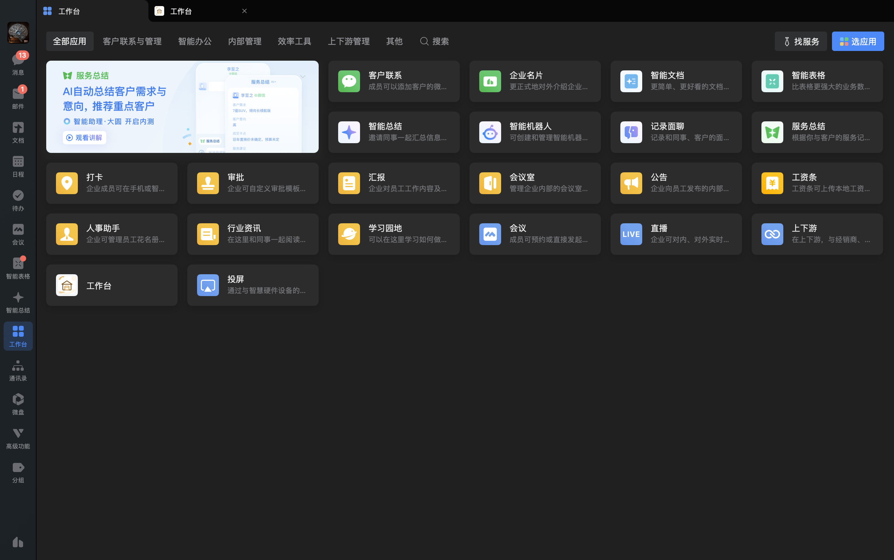

*图 3-1A 企业微信工作台入口。截图应包含应用名称和图标。*

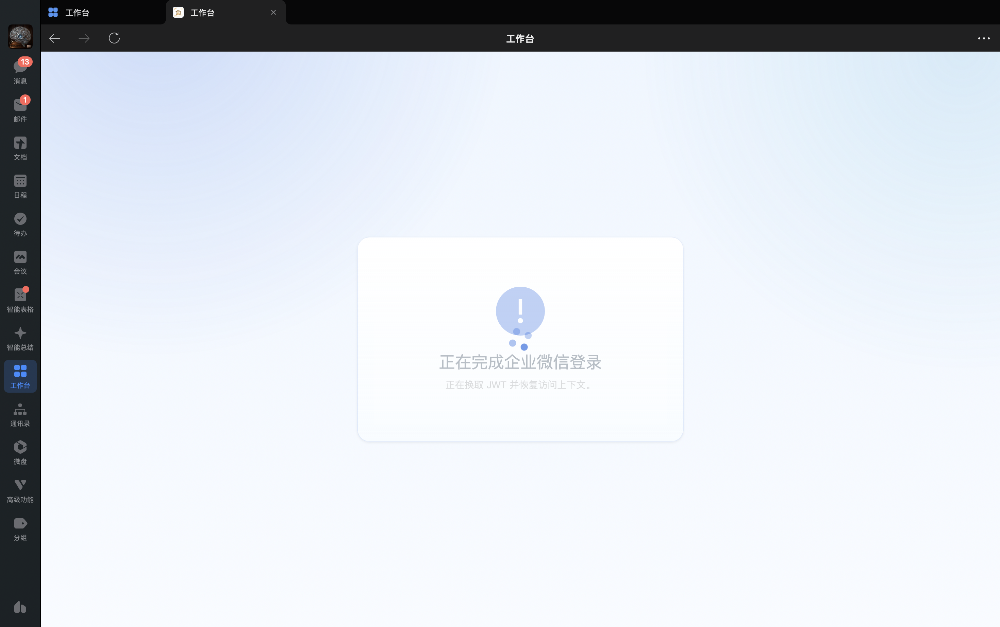

*图 3-1B 企业微信授权中页面。截图应包含企业微信环境提示和加载状态。*

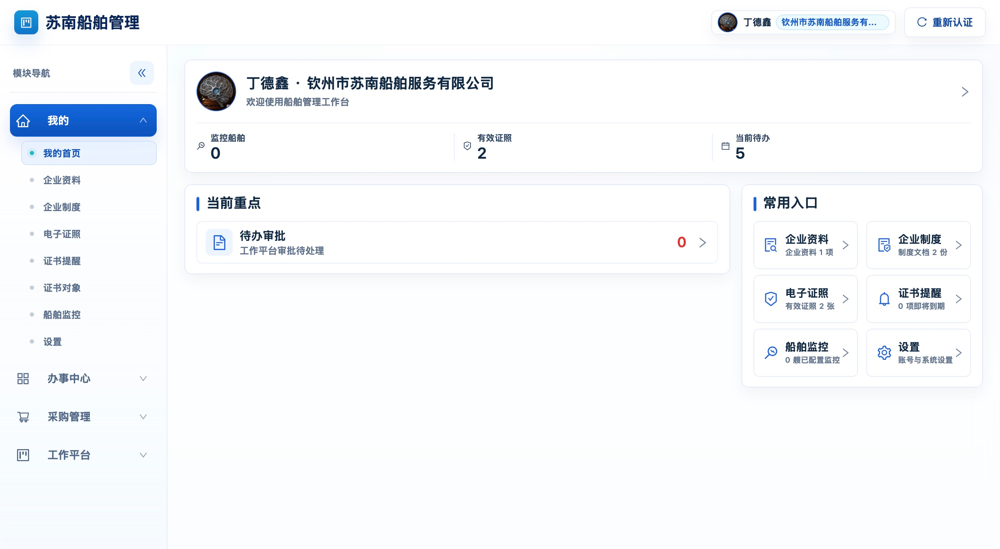

*图 3-1C 授权完成后的系统首页。截图应标注头像、姓名、角色和主要入口。*

### 3.2 从消息或链接直达

审批通知或业务链接可能直接打开详情页。进入后先核对：

- 页面标题和业务编号；
- 船舶、部门或业务范围；
- 当前状态和截止时间；
- 当前负责人、参与人或审批节点；
- 页面上实际出现的可执行按钮。

若认证过期，系统会保存安全的站内目标路径，完成认证后返回原页面。外部地址、双斜杠地址或异常跳转目标会被系统降级到“我的”首页。

### 3.3 重新认证

桌面端顶部和移动端导航抽屉提供“重新认证”。

出现以下情况时可使用：

- 企业微信部门或岗位刚发生变化；
- 页面持续提示登录失效；
- 角色与当前岗位不一致；
- 企业微信账号切换；
- 深链打开后返回错误身份。

操作步骤：

1. 记录当前业务编号和页面地址。
2. 点击“重新认证”。
3. 等待企业微信授权完成。
4. 返回原页面后重新读取记录状态。
5. 不要在状态未确认前重复提交。

### 3.4 桌面端导航

桌面端左侧按四个一级板块分组：

- 我的
- 办事中心
- 采购管理
- 工作平台

点击分组可展开二级入口；侧边栏可收起。当前页面会高亮。详情页通常保留所属板块高亮，使用浏览器返回或页面返回按钮回到上一级。

### 3.5 移动端导航

移动端底部固定显示四个一级板块。右上角优先显示企业微信头像，点击后打开“更多”导航抽屉；头像不可用时显示姓名首字。抽屉中可查看当前用户、角色、各板块二级入口并重新认证。

移动端建议：

- 完成当前任务后再切换板块；
- 不在多个企业微信窗口同时编辑同一记录；
- 表格可在表格区域横向滑动，页面整体不应横向滚动；
- 详情页优先从消息或待办直达，减少多层返回。

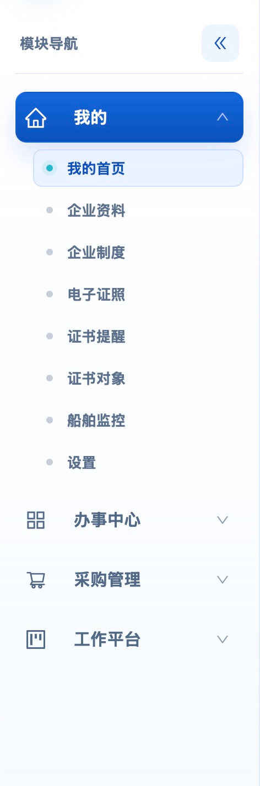

*图 3-2A 桌面侧边导航。截图应包含四个一级板块、二级入口和重新认证。*

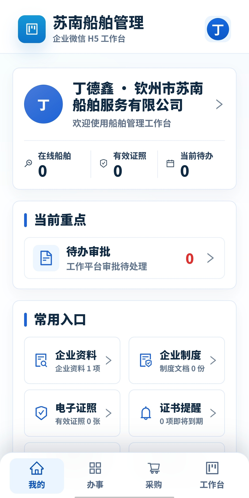

*图 3-2B 移动底部导航。截图应包含当前板块高亮和右上角用户头像。*

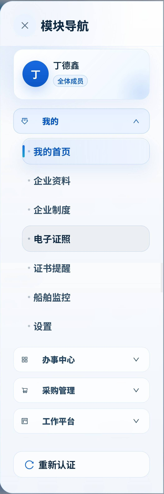

*图 3-2C 移动“更多”抽屉。截图应包含用户身份、角色、二级入口和重新认证。*

### 3.6 当前主要路由地图

此表主要供培训、支持和排障使用，普通用户不需要手工输入带参数的地址。

| 板块 | 页面 | 路径 |
|---|---|---|
| 我的 | 首页 | /my |
| 我的 | 企业资料 | /my/enterprise-profile |
| 我的 | 企业制度 | /my/enterprise-policy |
| 我的 | 电子证照 | /my/certificates |
| 我的 | 证书提醒 | /my/reminders |
| 我的 | 证书对象 | /my/master-data |
| 我的 | 船舶监控 | /my/monitors |
| 我的 | 设置 | /my/settings |
| 办事 | 首页 | /office |
| 办事 | 搜索 | /office/search |
| 办事 | 治理台 | /office/admin |
| 采购 | 采购单列表 | /procurement |
| 采购 | 新建采购单 | /procurement/orders/new |
| 采购 | 采购审批 | /procurement/approvals |
| 采购 | 采购报表 | /procurement/reports |
| 采购 | 报表审批 | /procurement/report-approvals |
| 采购 | 字典治理 | /procurement/dictionaries |
| 采购 | 年度预算 | /procurement/budgets |
| 工作平台 | 首页 | /workbench |
| 工作平台 | 考勤统计 | /workbench/statistics/attendance |
| 工作平台 | 审批看板 | /workbench/approvals |

## 4. 通用操作

### 4.1 页面加载、空态与错误态

| 页面反馈 | 含义 | 建议操作 |
|---|---|---|
| 加载中、骨架或转圈 | 正在读取服务端数据 | 等待完成，不重复刷新 |
| 暂无数据 | 当前权限和筛选下没有记录 | 清空筛选，再确认数据范围 |
| 加载失败，请重试 | 网络或服务异常 | 保留业务信息，重试一次 |
| 无权访问或记录不存在 | 可能是权限不足，也可能是资源无效 | 核对账号和链接，联系管理员 |
| 状态冲突 | 记录已被他人处理或不允许当前动作 | 刷新详情后按新状态操作 |
| 参数或前置条件不满足 | 必填、职责、日期或闭环门槛不合法 | 按页面提示补全，不重复创建 |

### 4.2 查询、筛选与分页

常见查询方式包括：

- 关键字搜索；
- 状态筛选；
- 分类、部门、船舶或对象筛选；
- 日期范围筛选；
- 列表分页；
- 看板卡片下钻；

桌面端查询、筛选和同行表单控件通常横向排列；空间不足会自动换行。移动端多数改为单列，主要按钮可能铺满可用宽度。按钮换行不代表功能缺失，应上下滚动查看完整工具栏。

推荐步骤：

1. 先选择业务范围或部门。
2. 再选择状态和日期。
3. 最后输入标题、摘要或编号关键字。
4. 无结果时清空全部筛选。
5. 检查是否超出近 3 年等业务查询限制。

系统部分列表会把筛选条件保存在地址中，从详情返回时可恢复列表状态和滚动位置。

### 4.3 新建、保存与提交

“保存”和“提交”含义不同：

| 按钮 | 常见含义 |
|---|---|
| 新建、创建草稿 | 生成可继续编辑的记录 |
| 保存 | 保存当前字段，不一定进入流程 |
| 保存草稿 | 保留未提交记录 |
| 保存并提交、提交审批 | 保存后进入审批或流程 |
| 完成步骤 | 推进当前工作平台步骤 |
| 提交审核 | 全部执行步骤完成后进入复核 |

提交前应核对：

- 部门、船舶、对象和责任人；
- 业务日期、计划时间和截止时间；
- 必填字段；
- 附件或现场证据；
- 当前状态；
- 是否会进入系统内审批或企业微信审批。

提交按钮显示加载时不要连续点击。失败后应在原记录中重试，不要直接新建第二条。

### 4.4 常见状态

| 领域 | 状态 | 含义 |
|---|---|---|
| 通用 | 草稿 | 可编辑，尚未正式提交 |
| 通用 | 已提交、处理中 | 已进入流程 |
| 通用 | 已完成、已关闭 | 业务终态，通常只读 |
| 通用 | 已驳回、需返工 | 按意见修改后重提 |
| 企业资料 | 草稿、已发布、已归档 | 资料生命周期 |
| 企业制度 | 草稿、已发布、已废弃 | 制度生命周期 |
| 证照 | 有效、已过期、已归档 | 证照状态 |
| 采购单 | 草稿、已提交、部门通过、终审通过、已驳回 | 采购审批状态 |
| 报表审批 | 草稿、已提交、部门通过、财务通过、终审通过、已驳回 | 报表审批状态 |

### 4.5 文件、照片和附件

#### 4.5.1 上传步骤

1. 先阅读上传区的“上传前请确认”，核对允许格式和单文件上限。
2. 点击“上传文件”。
3. 选择一个符合格式和大小要求的文件。
4. 等待上传进度达到 100%。
5. 确认页面显示正确文件名；如需要可先点击“预览文件”。
6. 在业务页面点击保存、绑定或提交。
7. 返回详情检查“已绑定附件”。

某些现场页面在企业微信 JS-SDK 就绪后显示“拍照上传”。该按钮未启用时，可使用“上传文件”选择相册或本地文件。

如果上传策略加载失败，上传按钮会禁用并显示“重新加载”。应先重新加载规则，不要通过修改文件后缀绕过格式校验。

#### 4.5.2 文件限制

| 类别 | 允许格式 | 单文件上限 |
|---|---|---:|
| 电子证照 | PDF、JPG、PNG、JPEG | 20MB |
| 企业资料 | PDF、JPG、JPEG、PNG、DOC、DOCX、XLS、XLSX、TXT、CSV、HEIC、ZIP、RAR、WPS、ET、DPS | 20MB |
| 企业制度 | PDF、JPG、JPEG、PNG、DOC、DOCX、XLS、XLSX、TXT、CSV、HEIC、ZIP、RAR、WPS、ET、DPS | 50MB |
| 采购附件 | PDF、JPG、JPEG、PNG、DOC、DOCX、XLS、XLSX、TXT、CSV、HEIC、ZIP、RAR、WPS、ET、DPS | 20MB |
| 采购导出 | PDF | 20MB |
| 工作台、会议等通用附件 | PDF、JPG、JPEG、PNG、DOC、DOCX、XLS、XLSX、TXT、CSV、HEIC、ZIP、RAR、WPS、ET、DPS | 20MB |

#### 4.5.3 预览与下载

已绑定附件列表统一显示文件名、类型、大小以及“预览”“下载”操作。系统内预览不以企业微信 JS-SDK 为前置条件：

| 文件类型 | 预览行为 |
|---|---|
| PDF | 在系统预览弹窗中打开 |
| JPG、JPEG、PNG | 等比显示，长图可滚动 |
| HEIC | 转换为可显示图片后预览；转换失败时仍可下载 |
| TXT | 以安全纯文本显示，最多读取前 2MB |
| CSV | 以只读表格显示，最多 500 行、50 列和前 2MB |
| DOC、DOCX、XLS、XLSX、WPS、ET、DPS、ZIP、RAR | 显示文件信息和“不支持在线预览”提示，可下载原文件 |

- 每次预览或下载都会重新获取短时授权地址，不要复制后长期保存或转发。
- 预览失败时留在弹窗内查看原因，并可继续尝试下载原文件。
- 打不开时先确认仍有源业务记录权限，再重新获取入口。
- 403 时不要尝试使用旧地址绕过记录权限。

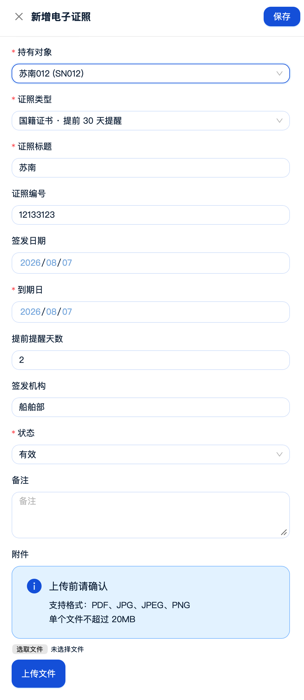

*图 4-1A 上传限制与上传进度。截图应包含支持格式、大小上限、上传按钮和进度。*

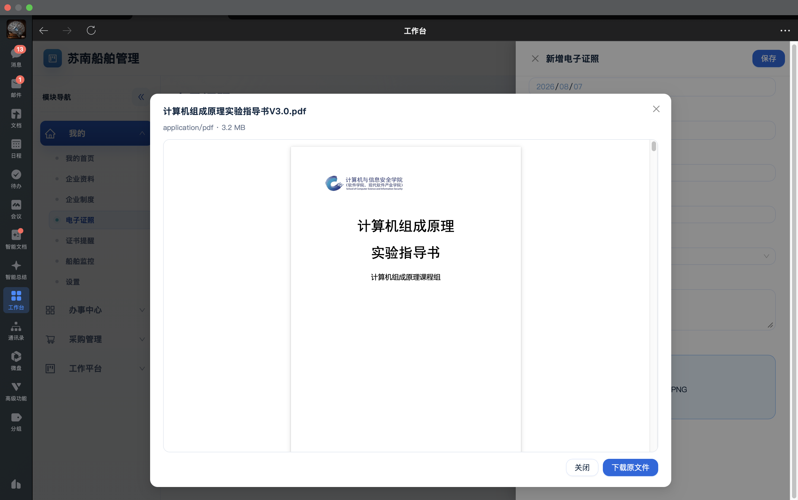

*图 4-1B 系统内文件预览。截图可选择 PDF、图片、TXT 或 CSV 中一种代表性格式。*

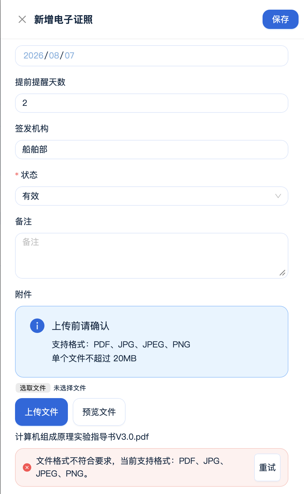

*图 4-1C 不支持在线预览格式。截图应包含文件信息、“不支持在线预览”和下载原文件按钮。*

#### 4.5.4 上传失败

出现失败时：

1. 检查网络和文件大小。
2. 保留当前业务页面。
3. 上传区仍保留原文件时，点击“重试”。
4. 规则加载失败时先点击“重新加载”；短时地址失效时重新选择同一文件。
5. 不要重复新建业务记录。

#### 4.5.5 附件删除与安全回收

证照、企业资料、企业制度详情的“已绑定附件”列表提供“删除”；采购草稿详情提供“解除关联”。这些操作只对有相应业务维护权限的用户开放。

1. 打开业务详情，核对目标文件名。
2. 点击文件旁的“删除”或“解除关联”，不要与整条业务记录的删除按钮混淆。
3. 阅读确认说明；采购附件还必须填写解除原因。
4. 确认后等待成功或失败提示，核对附件列表已刷新。

成功移除附件只表示解除当前业务的关联。系统会同时检查其他证照、资料、制度、采购单、工作平台记录、检查证据、签名、导出及历史证据是否仍引用文件。有其他引用时保留文件，不影响其他业务查看；没有引用时登记 24 小时回收期，至少保留完整 24 小时。删除整条证照、资料或制度、替换附件也使用同一规则，并保留操作者和文件信息快照。

后台每小时检查到期文件，重新被引用的文件不会回收。确认无引用后进入持久化回收队列，文件不再允许重新绑定，随后删除 OSS 文件；删除失败会记录错误并自动重试。后台正常运行且无积压时，通常在 24 至 25 小时后释放当前文件占用，并非点击删除就立即释放空间。

本次上线后上传且已经登记文件信息、但未成功绑定业务的文件，也按 24 小时规则检查；历史孤立文件由上传人或系统管理员通过文件回收接口单独登记，不自动批量删除旧数据。当前没有附件回收站页面或一键恢复按钮，回收期不等于可撤销操作，误删应立即联系管理员。已经物理回收的文件只能重新上传。

工作平台历史附件、检查证据、签名、已提交审批的附件等仍按原权限和审计规则保护，不开放直接删除。只上传到 OSS 但未完成文件登记的对象，以及开启版本控制的历史版本，需管理员另行配置存储生命周期；系统不会盲目扫描或清空整个存储桶。

### 4.6 拍照、签名与定位

- 拍照：企业微信能力就绪后可拍摄或从相册选择，图片转存成功后才能绑定。
- 手写签名：部分通用工作平台详情提供签名画布，可清空后重新签写并确认保存。
- 定位：通用附件面板可调用浏览器定位；失败时允许填写人工位置说明。
- 定位拒绝或失败时不能填入虚构坐标，也不能复用旧坐标。

### 4.7 审批通道

| 业务 | 当前通道 | 处理位置 |
|---|---|---|
| 采购单 | 系统内审批 | 采购管理 > 采购审批 |
| 采购报表 | 系统内审批 | 采购管理 > 报表审批 |
| 航次审批等工作平台审批模块 | 企业微信审批 | 业务详情发起后进入企业微信原生审批 |
| 部分工作平台台账 | 系统内或按模块配置 | 以详情按钮和审批通道字段为准 |

不要因为页面出现“企业微信审批预留字段”就认为采购已切换原生审批。

### 4.8 打印与 PDF

1. 打开记录详情或报表审批单。
2. 确认状态满足打印条件。
3. 按页面实际按钮选择“预览 PDF”“导出 PDF”“打印 A4”“打印 A3”或“生成打印快照”。
4. 等待生成成功；生成期间不要重复点击。
5. 选择预览时，在系统弹窗内核对内容；选择导出时，等待浏览器开始下载。
6. 核对编号、版本、审批结论和生成时间。

采购单和报表审批单的“预览 PDF”与“导出 PDF”是两个独立动作。queued 或 running 只表示任务在排队/执行，不代表文件已经生成。只有 succeeded 且页面出现真实预览或下载入口后才可归档。failed 时应查看原因并使用受权重试。

### 4.9 审计与操作留痕

以下动作会形成审计或轨迹：

- 办事入口创建、更新、发布、停用和打开；
- 采购提交、退回、驳回、审批和附件解除；
- 工作平台步骤推进、审核、关闭和审批同步；
- 工作平台附件绑定、签名和定位证据保存；采购草稿附件解除关联。

原因和审批意见应写清事实、影响和下一步，不使用“同意”“已处理”等无法追溯的空泛描述。

## 5. “我的”板块

### 5.1 首页

“我的”首页集中展示：

- 已配置启用监控入口的船舶数量（不代表设备实时在线）；
- 有效证照数量；
- 今日待办；
- 证照预警；
- 当前用户头像、姓名、部门和角色；
- 企业资料、企业制度、电子证照、证书提醒、船舶监控、设置入口；
- 最近证照提醒和工作平台告警。

这些指标来自真实业务接口。若指标显示“-”或加载异常，应进入对应列表核对，不以截图缓存或口头统计替代。证照预警为 0 时，“当前重点”中的预警项和独立预警面板不会显示，这不代表页面加载失败。

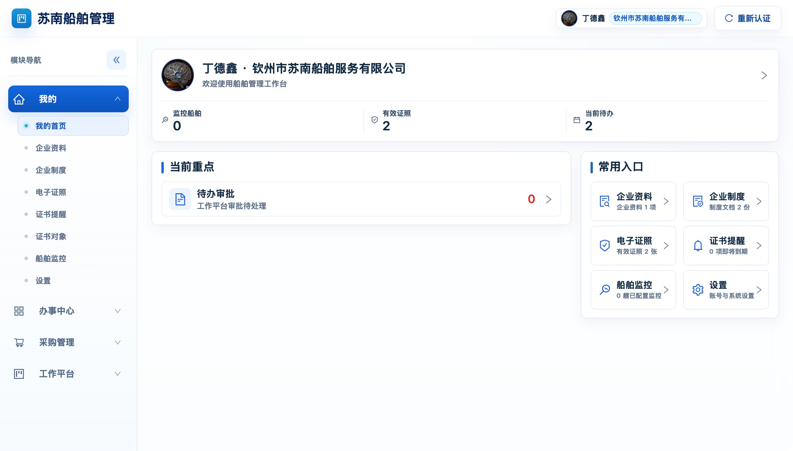

*图 5-1A “我的”首页总览。截图应标注指标、常用模块、今日待办和非零证照预警。*

*图 5-1B 用户头像与多部门展示。截图应包含头像、姓名、部门名称和角色；隐去敏感身份信息。*

### 5.2 企业资料

企业资料是“资质/公告”类资料条目，不是完整企业工商主档。

#### 5.2.1 新建资料

1. 进入“我的 > 企业资料”。
2. 在新建区域填写“标题”。
3. 选择分类“资质”或“公告”。
4. 点击“新建资料”。
5. 新记录以草稿创建。
6. 进入详情补充描述、状态和附件。

#### 5.2.2 筛选和查看

1. 点击“展开筛选”。
2. 按分类或草稿、已发布、已归档筛选。
3. 点击列表中的“详情”。
4. 从详情返回时，列表筛选会保留。

#### 5.2.3 编辑详情

详情可维护：

- 标题；
- 分类；
- 状态；
- 描述；
- 新附件。

上传附件后必须点击“保存”，否则文件可能尚未绑定到资料。

已绑定附件可直接点击“预览”或“下载”；有维护权限时可点击文件旁的“删除”，按第 4.5.5 节安全回收规则处理。

#### 5.2.4 删除

只有有权限用户才应执行删除。删除前确认：

- 资料不是当前有效制度或证照的替代品；
- 没有需要保留的审计、合规或归档义务；
- 选择的是正确条目。

当前列表删除入口属于高风险操作，点击前应再次核对标题和状态。

点击业务记录的“删除”并确认后，资料会软删除并从默认列表中移除；其附件解除关联，无其他引用时进入 24 小时回收期，审计快照继续保留。

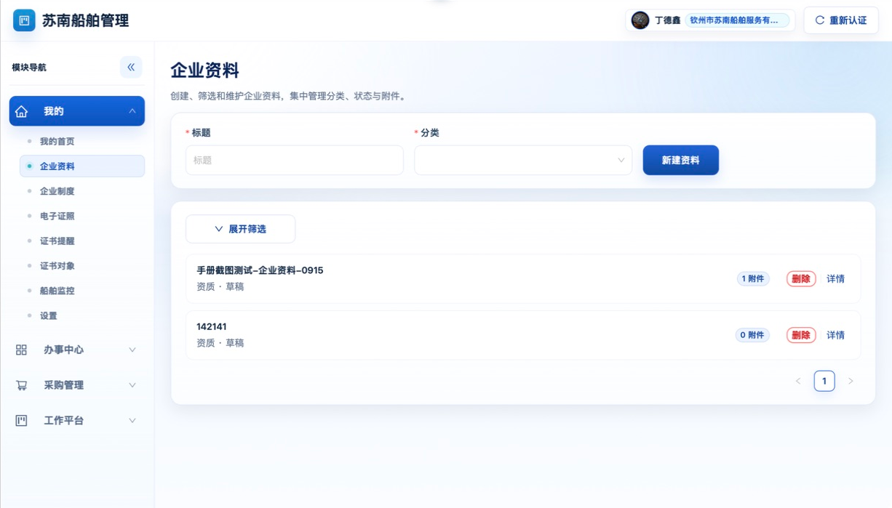

*图 5-2A-1 企业资料列表。*

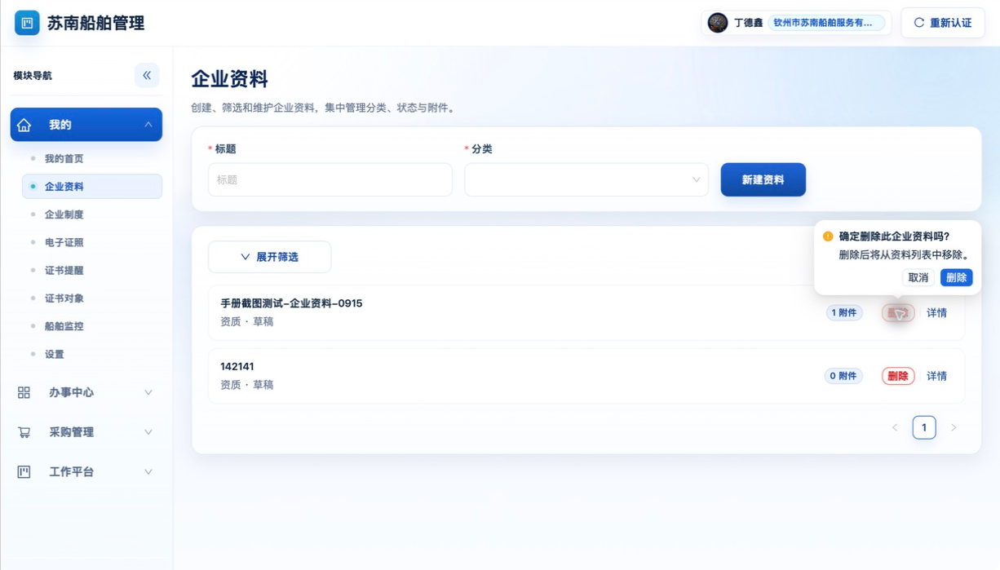

*图 5-2A-2 企业资料删除确认。*

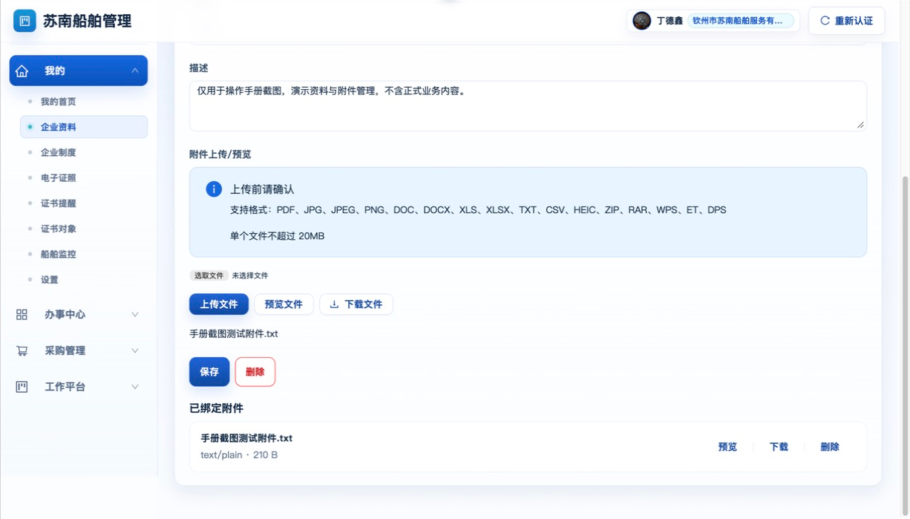

*图 5-2B-1 企业资料详情与附件。*

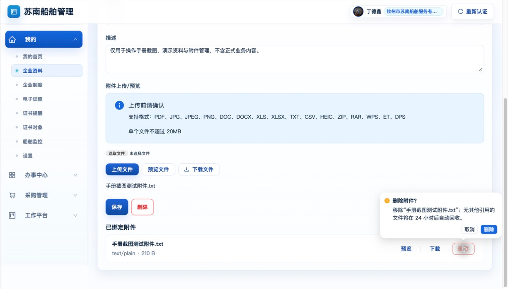

*图 5-2B-2 企业资料附件删除确认及 24 小时回收提示。*

### 5.3 企业制度

#### 5.3.1 新建制度

1. 进入“我的 > 企业制度”。
2. 填写制度标题。
3. 填写稳定的制度编码。
4. 填写版本，默认示例为 v1。
5. 点击“新建制度”。

#### 5.3.2 查询制度

- 可按标题或编码关键字搜索；
- 可按草稿、已发布、已废弃筛选；
- 列表显示制度编码、版本和状态。

#### 5.3.3 编辑、上传和发布

1. 点击“详情”。
2. 编辑制度标题、状态和摘要。
3. 按上传区提示选择制度文件；支持 PDF、图片、Office/WPS、TXT、CSV、HEIC 和压缩包等通用格式，单文件不超过 50MB。
4. 点击“保存”。
5. 返回列表核对版本历史。
6. 制度完成内部审核后，在列表点击“发布”。

已发布制度需要修订时，应创建新版本或按公司制度管理流程处理，不要用新文件静默覆盖旧版本语义。

已绑定制度附件可从列表预览或下载；有维护权限时可单独删除附件，按第 4.5.5 节安全回收规则处理。Office/WPS 和压缩包会显示文件信息并提示下载后查看。

有权限用户可在制度列表点击“删除”并确认。删除采用软删除，制度及其版本不会再出现在默认列表中，历史审计数据仍保留。

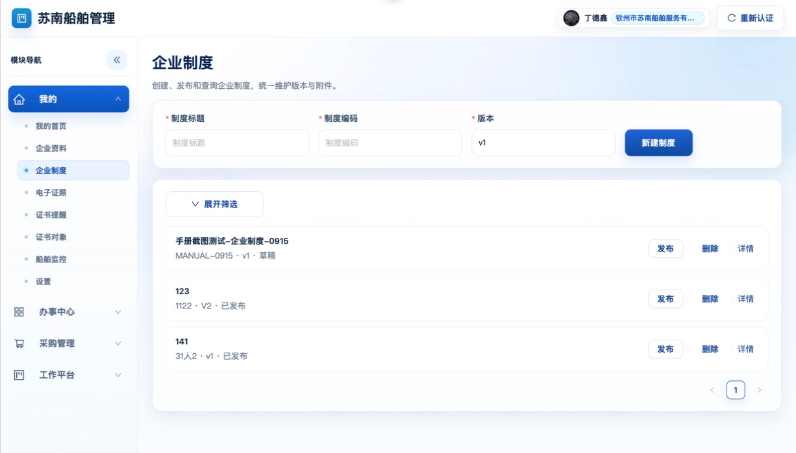

*图 5-3A-1 企业制度列表。*

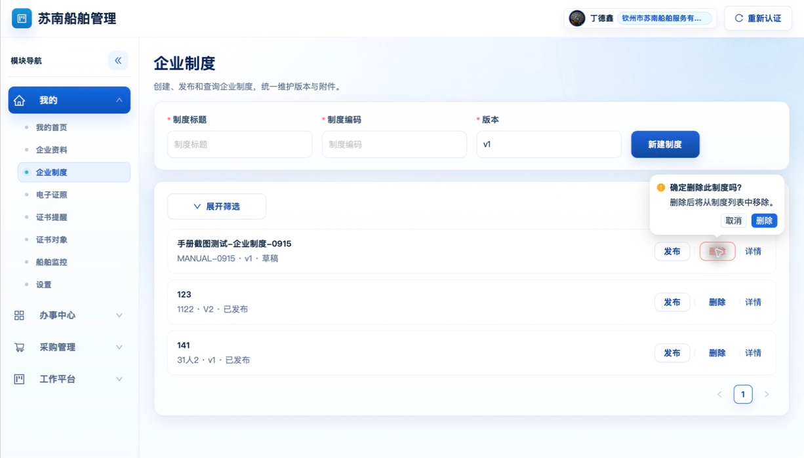

*图 5-3A-2 企业制度删除确认。*

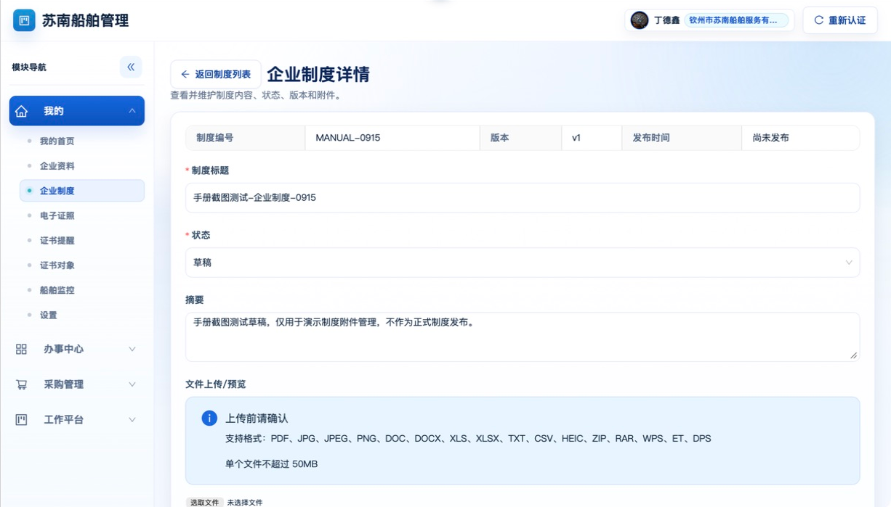

*图 5-3B-1 企业制度详情基础信息。*

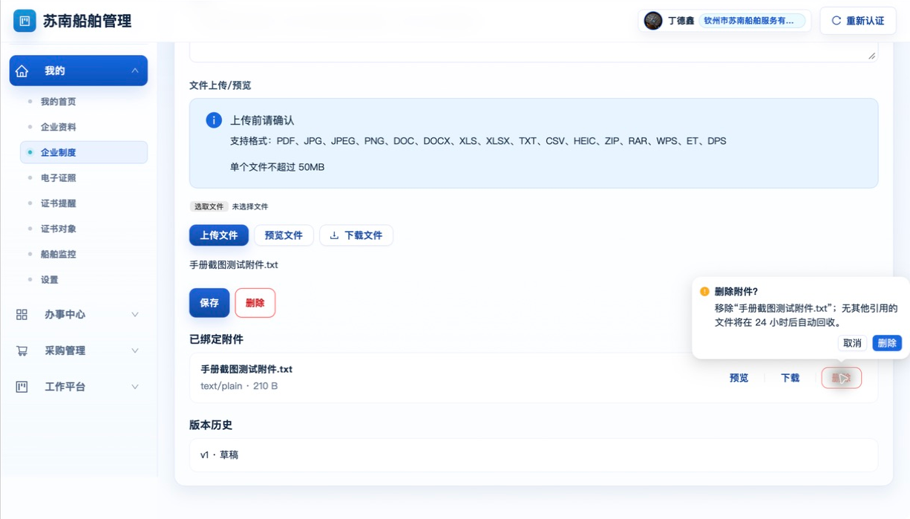

*图 5-3B-2 企业制度附件删除确认及 24 小时回收提示。*

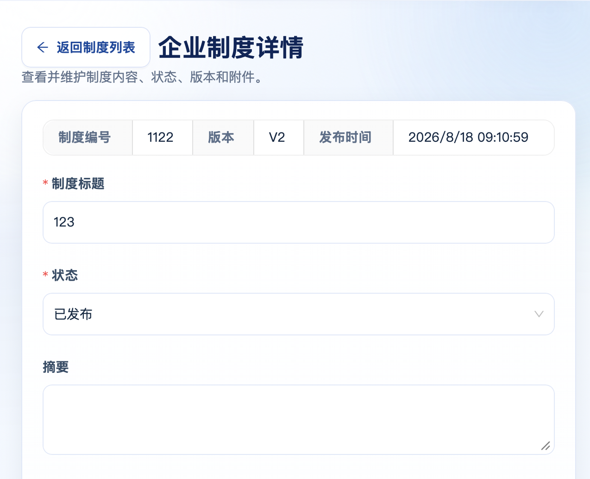

*图 5-3C-1 企业制度版本历史。*

### 5.4 电子证照

#### 5.4.1 浏览和筛选

1. 进入“我的 > 电子证照”。
2. 按需在“船舶、车辆、人员、设备”之间筛选持有对象类型；该筛选不会改变统计分组。
3. 点击“展开筛选”。
4. 证照统计固定按证照分类分组，不再按持有对象分组。
5. 按有效、已过期、已归档筛选。
6. 输入关键字搜索。
7. 点击证照标题进入详情。

分组卡片会显示证照总数和各证照分类的张数；列表同时显示持有对象、编号、签发/到期时间、签发机构、附件数和提醒配置。列表会保留筛选和滚动位置，返回后可继续浏览。

#### 5.4.2 新增证照

1. 点击“新增证照”。
2. 选择持有对象类型。
3. 从受控列表选择具体船舶、车辆、人员或设备。
4. 选择证照类型，页面会显示该类型默认提前提醒天数。
5. 填写证照标题。
6. 按需填写证照编号、签发机构和备注。
7. 使用日期时间控件选择签发时间和到期时间；不能只填写 `YYYY-MM-DD` 日期。
8. 如需覆盖类型默认值，填写提前提醒天数。
9. 选择有效、已过期或已归档状态。
10. 上传证照附件。
11. 按需开启“企业微信提醒”，并可选择提醒负责人；两项都可以不设置。
12. 点击抽屉右上角“保存”。
13. 等待“电子证照已新增”提示。

#### 5.4.3 编辑证照

当前详情页可编辑完整证照信息：

- 持有对象类型及具体对象；
- 证照类型、编号和标题；
- 签发时间、到期时间和提前提醒天数；
- 签发机构、状态、备注和附件。
- 企业微信提醒开关和可选提醒负责人。

签发时间和到期时间必须通过日期时间控件选择，接口会拒绝只有日期没有时间的值。修改持有对象或证照类型时，系统会重新校验对象是否有效、证照类型是否适用。

提醒负责人为可选项；编辑时将负责人清空并保存，即恢复按持有对象和部门规则推导收件人。

负责人下拉仅向有证照维护权限的用户提供；普通用户不会读取企业微信成员标识。

详情中的证照附件可在系统弹窗预览或下载。证照专用类别仍只接受 PDF、JPG、JPEG、PNG，不能上传通用 Office 或压缩包格式。

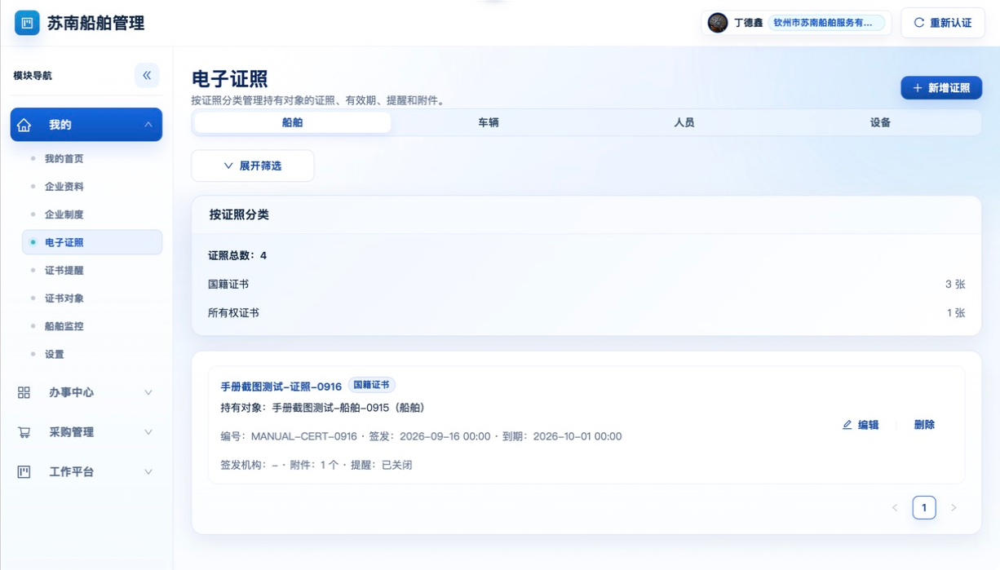

*图 5-4A-1 电子证照列表。*

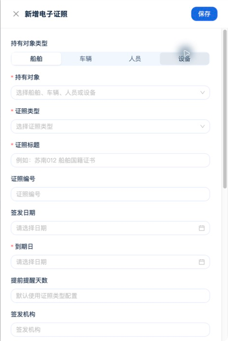

*图 5-4B-1 新增电子证照。*

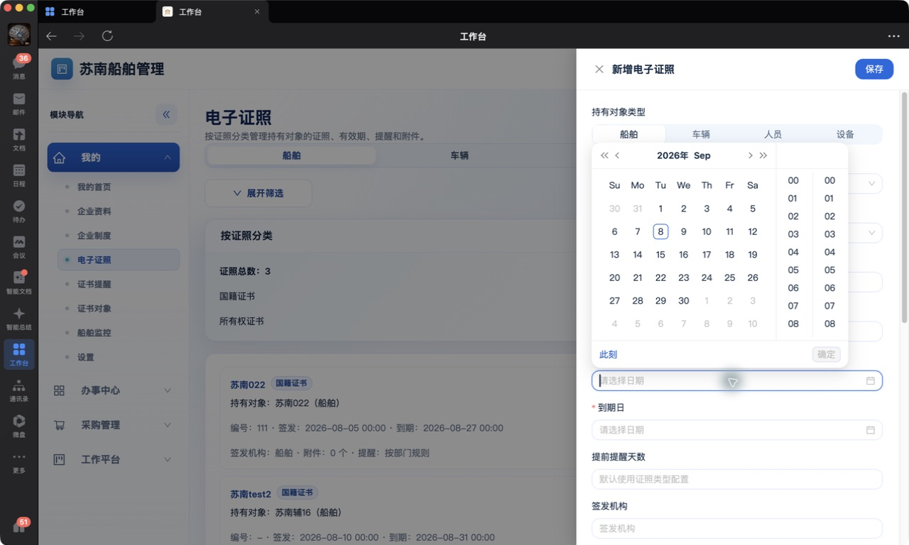

*图 5-4B-2 新增电子证照日期选择器。*

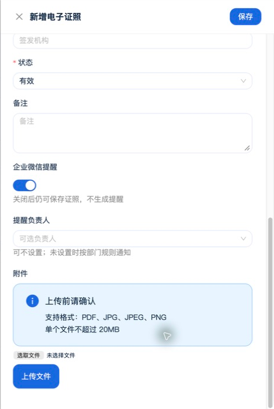

*图 5-4B-3 新增电子证照提醒与附件。*

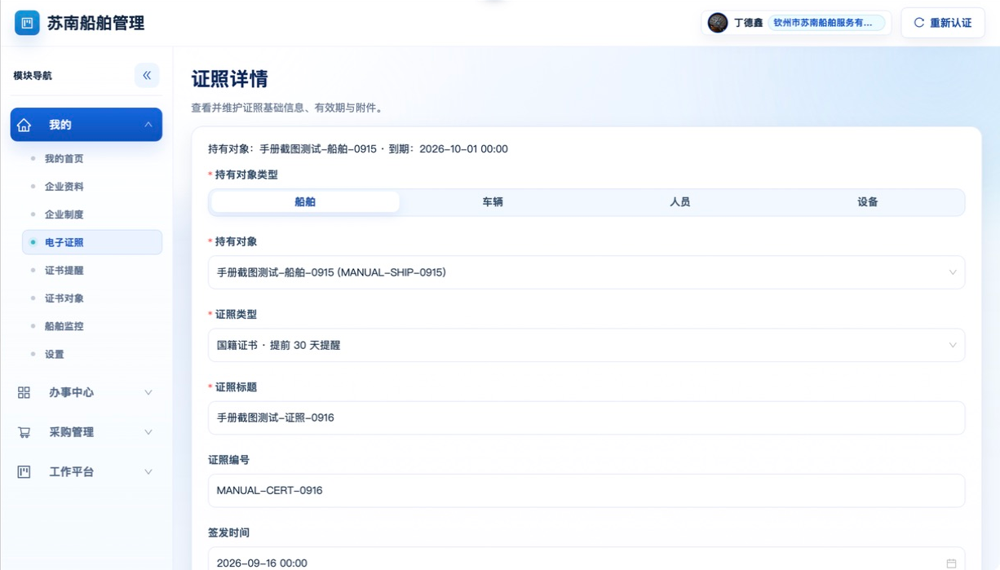

*图 5-4C-1 电子证照详情基础信息。*

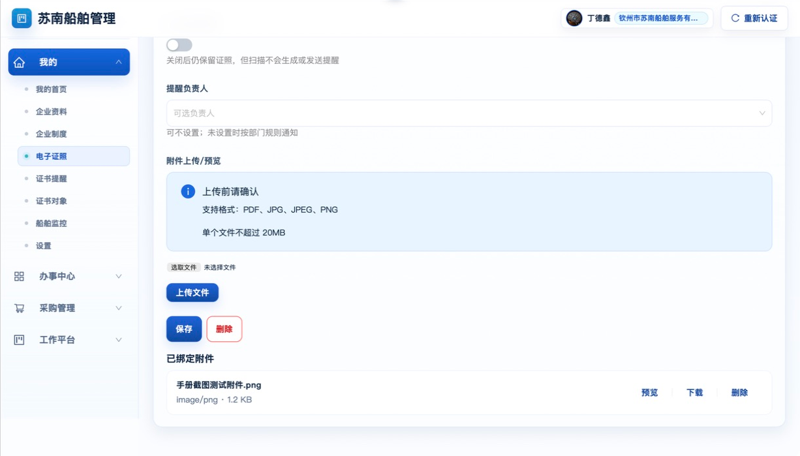

*图 5-4C-2 电子证照详情附件。*

证照列表和详情页均提供“删除”入口。确认后证照会软删除，不再出现在证照列表、持有对象选择器或新的提醒扫描中；已产生的提醒会自动标记为已处理，不会继续出现在默认看板。

### 5.5 证书提醒

#### 5.5.1 看板与自动提醒

看板提供：

- 待处理数量；
- 已逾期数量；
- 已确认数量；
- 按证书类型/分类分组；
- 最近提醒。

点击统计卡会进入对应提醒列表。

系统会按上海时间自动检查启用提醒的证照：证照新增或编辑后会触发一次检查，后台随后每五分钟检查一次。检查发现临期或过期证照时，会生成提醒并按负责人设置或部门规则发送企业微信消息；负责人可以留空。看板会自动显示当前账号有权查看的待处理、已逾期和已确认提醒，不需要先点击扫描。

“待处理”统计临期且尚未确认的提醒，包括已经发送到企业微信但尚未确认的记录；“已逾期”统计到期日已过且尚未确认的提醒，“已确认”统计已经完成确认的记录。已确认或已处理的提醒不会继续出现在默认看板，但仍可点击“已确认”查看历史。

同一证照、同一接收人、同一到期周期只保留一条提醒。系统每天检查时会更新这条记录，不会因为日期变化而重复生成逾期提醒。

#### 5.5.2 列表筛选

列表支持：

- 待处理或已确认状态；
- 逾期提醒类型；
- 船舶、车辆或人员对象；
- 每页 5、10 或 20 条。

#### 5.5.3 确认提醒

1. 打开提醒详情。

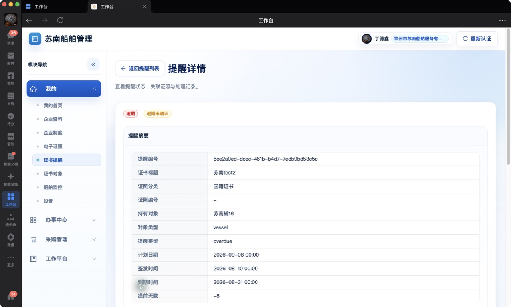

*图 5-5B-1 证书提醒详情。*

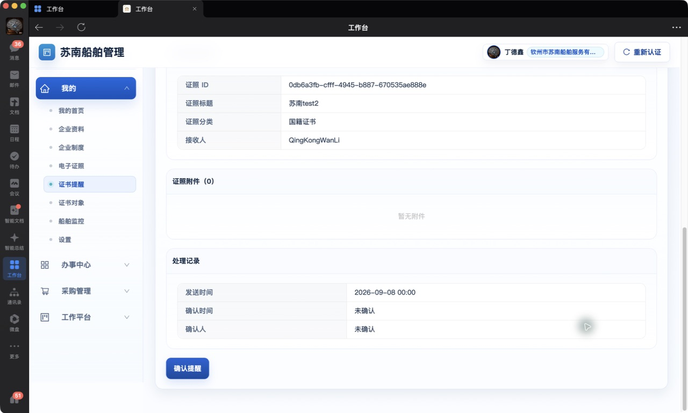

*图 5-5B-2 证书提醒接收人与确认。*
2. 核对证书标题、持有对象、提醒类型、计划日期和接收人。
3. 查看发送时间和已有确认记录。
4. 完成线下续证或确认处置后，点击“确认提醒”。
5. 等待“提醒已确认”。

同一提醒被其他人先确认时，页面会提示已经确认，不需要重复操作。

#### 5.5.4 手动补扫（可选）

只有有权限用户可见“手动扫描”，用于立即补扫或验证规则，不是日常使用前置步骤：

1. 点击“手动扫描”。
2. 等待系统返回扫描任务编号。
3. 在任务状态条中观察排队、处理中、完成或失败状态。
4. 完成后核对新增、发送、失败数量；失败时按错误原因处理。
5. 核对新提醒是否按到期日生成。

扫描只生成或更新提醒，不会自动续证、修改证照或替代线下办理。证照关闭企业微信提醒时不会生成发送任务；未设置负责人时按对象和部门规则推导收件人。同一扫描任务完成或失败只提示一次，页面会自动刷新看板和列表。

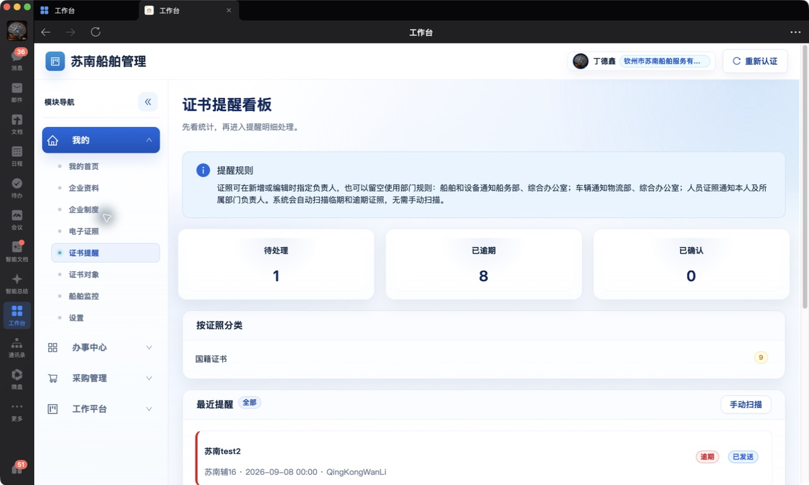

*图 5-5A 证书提醒看板。截图包含待处理、已逾期、已确认、按证照分类统计和提醒列表入口。*

### 5.6 船舶监控

普通用户：

1. 进入“我的 > 船舶监控”。
2. 只查看启用中的监控入口。
3. 点击“打开”进入外部监控地址；嵌入模式点击“查看监控”。若监控平台不支持嵌入，使用弹窗内“外部打开”。

仅系统管理员可配置：

1. 按船名或编码从下拉框选择有效船舶，无需填写 ID。暂无船舶时，先在“证书对象”维护船舶。
2. 填写监控名称和以 `http://` 或 `https://` 开头的完整地址，支持内网 IP 和端口。
3. 选择访问方式、排序和启用状态，再点击“新增监控”。
4. 列表支持编辑、停用、重新启用和删除；同船同名会明确提示，保存失败保留填写内容。
5. 停用项仍保留在管理员列表，普通成员不可见；船舶已停用或删除时，可停用/删除旧入口，新建、换船或启用需选择有效船舶。

总经办、财务部、业务部、船务部、后勤部及普通成员均不显示新增表单。系统管理员可在列表中删除错误或废弃的监控入口；删除前会二次确认。该模块是外部监控入口管理，不等同于系统内置 AIS、CCTV 台账或值班交接。

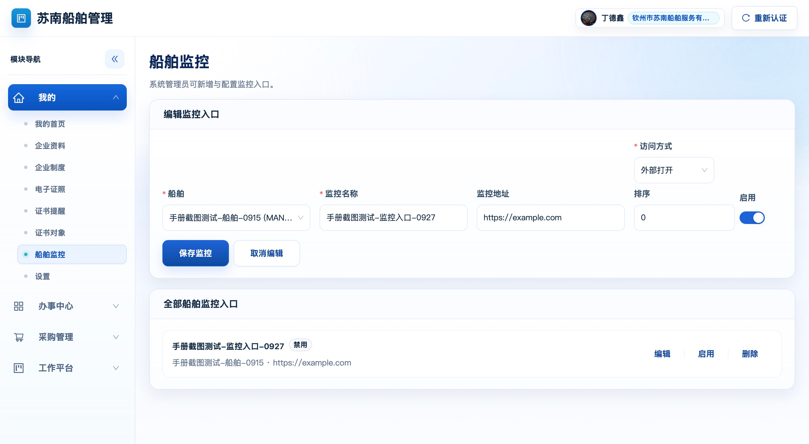

*图 5-6 船舶监控（待按新版重拍）。新版应包含船舶选择器、访问方式、排序、启用状态及编辑/启停/删除操作。*

### 5.7 设置

设置页包含：

- 提醒视图：看板或列表；
- 证照分组：按证照分类（固定）；
- 推送通知：开启或关闭。

设置改动后自动保存，不需要另点保存按钮。保存失败时页面会恢复到上一次成功值并显示错误，不要连续切换。

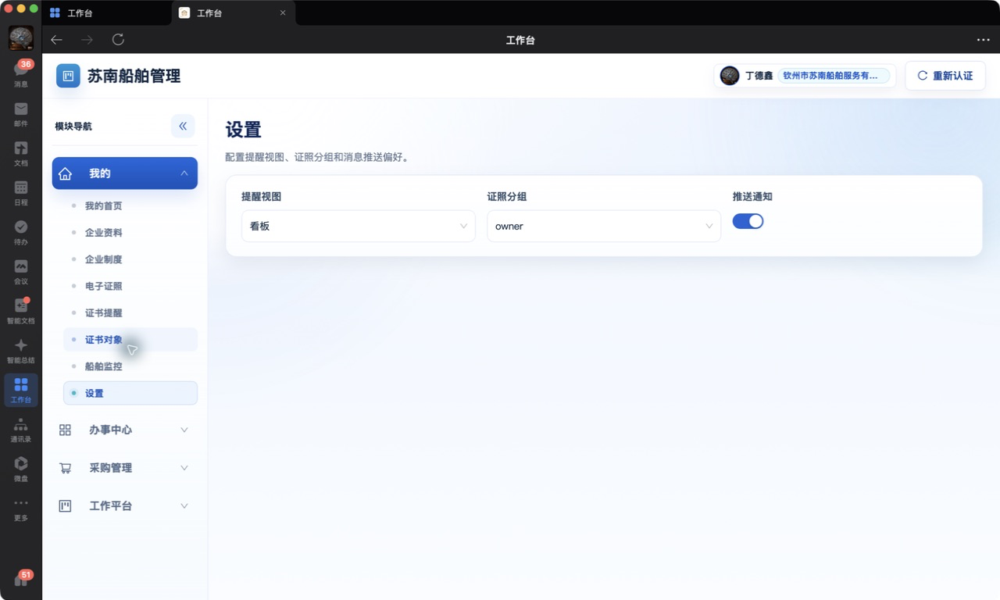

*图 5-7-1 个人设置。*

### 5.8 证书对象（持有对象维护）

证照中的船舶、车辆、人员和设备来自“我的 > 证书对象”（路径 `/my/master-data`）。在“我的”导航中，该入口位于“证书提醒”下方。有维护权限的用户可在对应分类点击“新增船舶/车辆/人员/设备”或列表中的“编辑”，保存后对象会立即出现在证照表单的受控选择器中。证照表单不再放置“维护对象”快捷按钮；需要维护对象时请从导航进入本页面。对象停用后不会出现在新证照选择器中，但历史证照仍保留原名称。

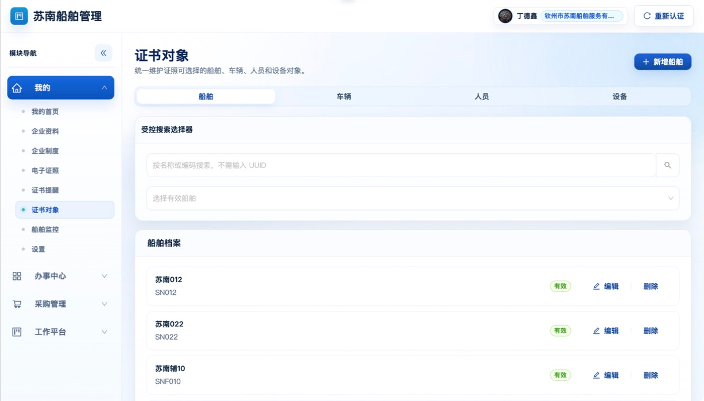

*图 5-8-1 证书对象导航及列表。*

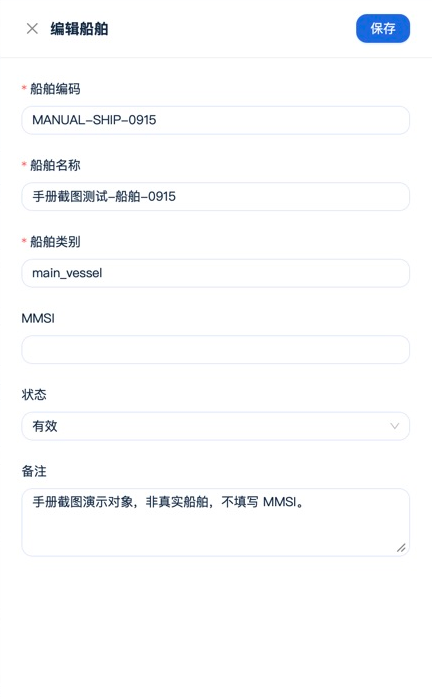

*图 5-8-2 证书对象维护。*

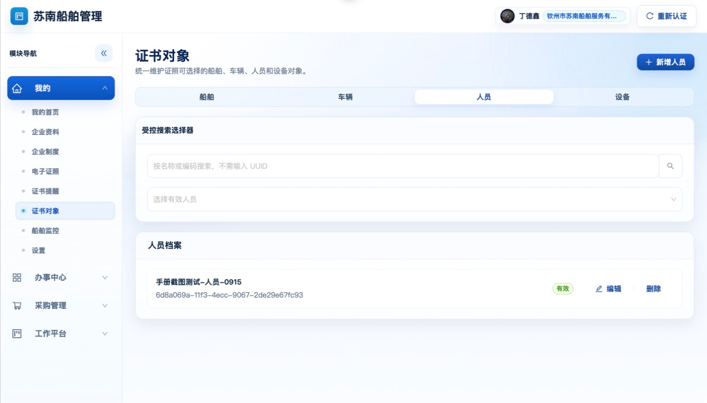

*图 5-8-3 证书对象人员编辑与删除。*

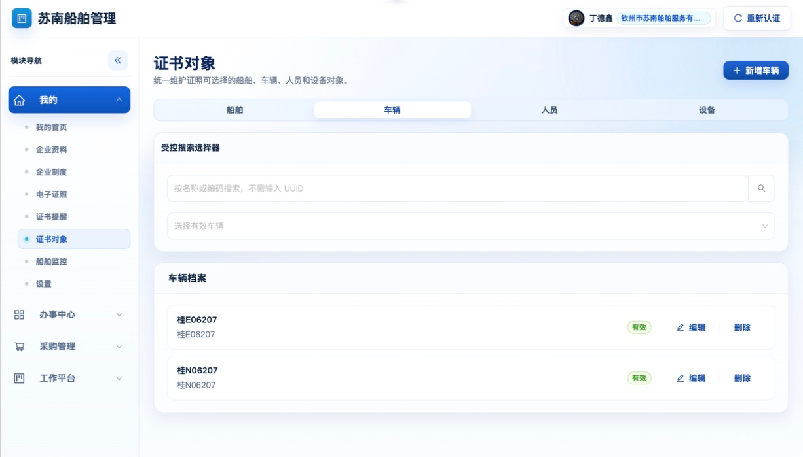

*图 5-8-4 证书对象车辆编辑与删除。*

## 6. “办事”板块

### 6.1 办事首页

办事板块是企业微信内统一服务入口门户。固定分类包括：

- 海事端口；
- 海关端口；
- 边检端口；
- 船检端口；
- 环保端口；
- 其他端口；
- 石化园区端口。

首页只显示已发布且当前账号有权访问的入口。

操作步骤：

1. 进入“办事”。
2. 使用顶部关键字搜索或选择分类。
3. 查看“高频办事入口”卡片。
4. 核对入口标题、摘要和分类。
5. 点击“打开入口”。

系统会记录打开动作。入口可能在当前 WebView、站内路由或新窗口打开。

### 6.2 搜索

1. 在首页输入标题、摘要或事项关键字。
2. 点击“搜索”或按回车。
3. 在搜索页按分类进一步过滤。
4. 点击结果卡片打开。
5. 无结果时清空分类并换用简称。

“高级筛选”当前进入同一搜索结果流程，不代表存在额外复杂条件。

### 6.3 办事治理权限

只有具备分类维护权的用户能进入治理台。权限按固定分类和角色分配，不支持普通用户自行新增分类。

无权访问时页面显示“当前账号没有办事分类维护权限”，不应让其他账号代为登录。

### 6.4 新增或编辑办事入口

治理表单包含：

- 分类；
- 标题；
- 摘要；
- 图标类型；
- 目标类型：外部地址或站内路由；
- 目标值；
- 打开方式：当前 WebView 或新窗口；
- 可见角色；
- 管理角色；
- 排序号。

新增步骤：

1. 点击“新增入口”。
2. 选择本人可管理的分类。
3. 填写标题和摘要。
4. 配置图标、目标类型和目标值。
5. 选择打开方式。
6. 设置可见角色和管理角色。
7. 填写非负排序号。
8. 点击“保存”。
9. 在草稿列表核对后再发布。

编辑现有入口时，先核对目标地址。外部链接应使用正式 HTTPS 地址，站内路由应以单斜杠开头。

### 6.5 发布、停用与审计

- 发布：让符合可见角色的用户能够访问。
- 停用：从普通用户入口中移除，但保留历史和审计。
- 删除：从治理列表和工作台入口中移除；删除前需要二次确认，审计记录仍保留。
- 编辑：更新入口信息。

治理台“最近审计记录”可按动作和入口筛选，显示时间、动作、入口、分类和操作人。已失效入口宜停用，不要用错误地址覆盖成另一个业务。

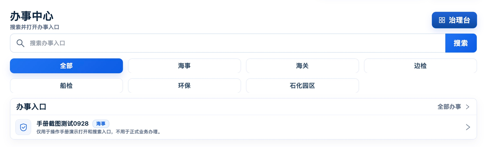

*图 6-1A 办事首页。截图应包含一体化搜索框、分类按钮和有权入口。*

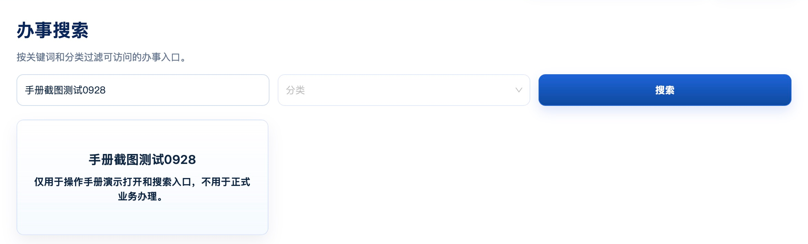

*图 6-1B 办事搜索结果。截图应包含关键字、分类筛选、结果和空态。*

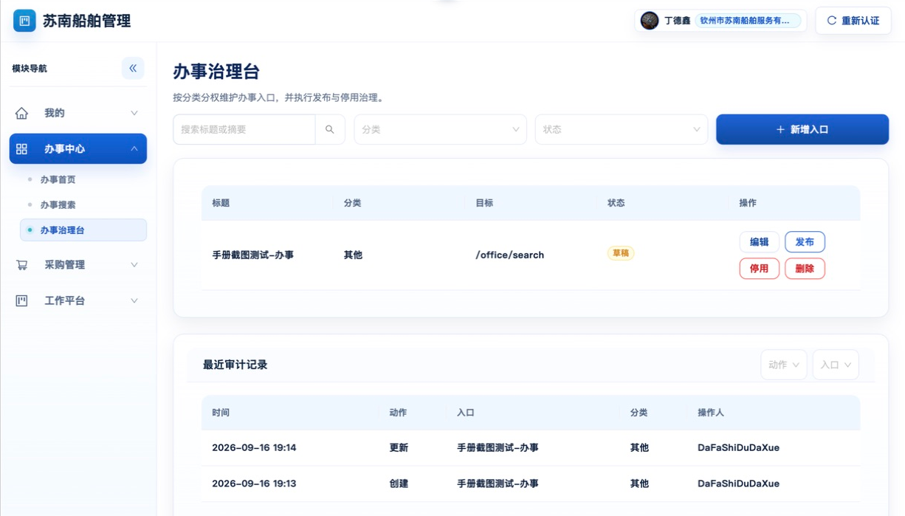

*图 6-1C 办事治理列表。*

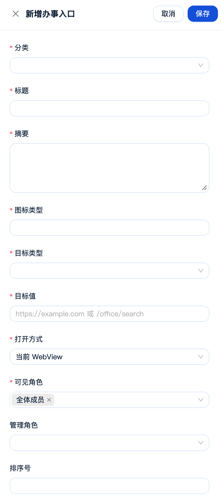

*图 6-1D 办事入口编辑抽屉。截图应包含目标、打开方式、可见角色和管理角色。*

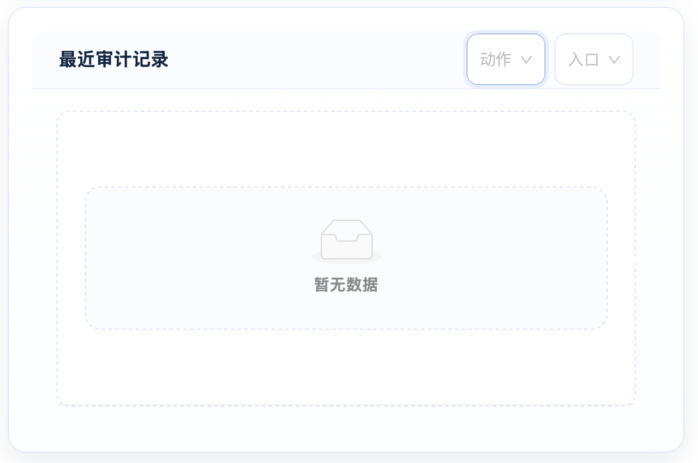

*图 6-1E 办事审计记录。截图应包含动作、入口、操作人和时间。*

## 7. “采购管理”板块

### 7.1 采购角色与审批链

采购单系统内审批链：

“草稿 -> 已提交 -> 部门主管审批 -> 总经办终审 -> 终审通过”

退回会回到草稿继续修改；如果该草稿曾经提交过，详情按钮显示“重新提交”。驳回进入“已驳回”，当前详情为只读，不能把驳回当成退回继续编辑。

报表审批链：

“草稿 -> 已提交 -> 部门主管 -> 财务部 -> 总经办 -> 终审通过”

### 7.2 采购首页和查询

采购首页提供：

- 新建采购；
- 采购审批；
- 采购报表；
- 报表审批；
- 有权限时的字典治理和预算管理；
- 当前年度预算摘要；
- 采购单列表和筛选。

筛选项包括：

- 标题或摘要关键字；
- 部门；
- 状态；
- 提交起始和截止日期；
- 船舶/后勤细分条件。

采购查询只支持近 3 年。超出范围时后端会拒绝，应缩短日期范围。

年度预算卡只有在预算总额和已执行金额均大于 0 时显示。已执行金额只统计费用日期属于目标年度且终审通过的采购单。

### 7.3 新建采购单

当前新建页字段：

- 部门；
- 细分类型；
- 细分对象；
- 标题；
- 摘要/事由；
- 金额；
- 费用日期。

操作步骤：

1. 进入“采购管理 > 新建采购单”。
2. 选择部门：总经办、业务部、财务部、船务部或后勤部。
3. 船务部自动使用“船舶”细分类型，并要求从后台字典选择船舶。
4. 后勤部自动使用“后勤类别”，并要求选择具体类别。
5. 其他部门细分类型为“无”。
6. 填写标题和摘要/事由。
7. 填写非负金额，保留两位小数。
8. 按需使用日期时间控件选择费用时间；接口不接受只有日期的值。
9. 选择“保存草稿”或“保存并提交”。

重要：当前 H5 新建页没有附件控件。需要附件时应先“保存草稿”，进入采购详情上传并确认绑定，再提交审批。不要先“保存并提交”后才发现缺少附件。

### 7.4 草稿编辑和重新提交

采购详情只有草稿可编辑。审批退回后状态回到草稿，因此可以继续修改；已驳回记录当前只读。

- 标题；
- 摘要/事由；
- 金额；
- 费用时间（日期时间控件）。

步骤：

1. 从采购列表打开详情。
2. 阅读状态、单号、部门和提交时间。
3. 在“草稿编辑”修改字段。
4. 点击“保存草稿”保留修改。
5. 材料齐全后点击“提交审批”或“重新提交”。

已进入审批的记录不应重复新建。先查看审批轨迹和驳回意见。

### 7.5 采购附件

#### 上传并绑定

1. 在草稿详情找到“附件上传”。
2. 点击“上传文件”。
3. 等待上传完成。
4. 页面自动绑定并提示“附件已上传并绑定”。
5. 在“已绑定附件”核对文件名、类型和大小。

#### 预览与下载

在已绑定附件中点击“预览”可打开系统预览弹窗，点击“下载”可保存原文件。Office/WPS 和压缩包不直接解析，但仍可在预览弹窗查看文件信息并下载。每次预览或下载都会重新校验采购单权限。

#### 解除与安全回收

1. 仅在可编辑草稿中点击“解除”。
2. 输入具体解除原因。
3. 点击“确认解除”。
4. 等待“附件关联已解除，无其他引用的文件将在 24 小时后回收”提示。

解除原因、操作者和文件信息快照保留，具体回收条件见第 4.5.5 节。

### 7.6 采购审批

1. 进入“采购管理 > 采购审批”。
2. 按部门筛选本人可处理的待办。
3. 点击“查看详情”，核对标题、部门、金额、摘要、附件和审批轨迹。
4. 返回审批列表。
5. 选择“通过”“退回”或“驳回”。
6. 在系统提示框中填写审批意见。
7. 退回和驳回必须填写意见；通过可填写意见。
8. 等待“审批操作已提交”。
9. 刷新待办，确认该项已离开当前节点。

当前采购审批在系统内完成，不会自动跳到企业微信审批中心。

### 7.7 采购单 PDF

采购详情对有读取权限的用户提供“预览 PDF”和“导出 PDF”，两者内容都反映生成当时的记录状态。需要正式归档时：

1. 确认采购单已经终审通过。
2. 打开采购单详情。
3. 点击“预览 PDF”。
4. 等待系统生成并在预览弹窗中打开。
5. 核对采购单号、金额、状态、审批轨迹和生成时间。
6. 关闭预览后点击“导出 PDF”保存文件。

草稿、审批中或已驳回状态也可以生成当前状态 PDF，但不得作为终审归档件。采购单模板和报表模板相互独立，不应混用。

### 7.8 采购报表

报表页包含：

- 月度汇总；
- 年度趋势；
- 部门采购明细；
- 船务/后勤细分明细；
- 报表审批单列表。

操作步骤：

1. 选择最近 3 年内的年份和月份。
2. 按需选择部门。
3. 查看月度汇总和年度趋势。
4. 在部门明细选择部门，再用日期时间控件选择开始和结束时间，点击“刷新”。
5. 在细分明细选择船务部或后勤部，按需填写细分对象和日期时间范围，点击“刷新”。

统计纳入已提交、部门通过、终审通过和已驳回采购单；草稿和软删除数据不纳入。

### 7.9 报表审批单

#### 创建

1. 在采购报表页选择年份、月份和可选部门。
2. 点击“生成月报审批单”或“生成年报审批单”。
3. 系统创建草稿并进入详情。
4. 核对业务标题、报表号、审批状态、统计周期、所属部门和审批通道。
5. 核对采购总额、采购单数、汇总维度、参数快照和汇总明细。
6. 查看“创建、部门审批、财务审批、总经办终审”四步审批进度。
7. 点击“提交审批”。

#### 审批

1. 进入“报表审批”。
2. 按部门筛选待办。
3. 打开详情核对业务摘要、参数快照、汇总明细、合计、审批进度和审批记录。
4. 按部门主管、财务部、总经办节点依次处理。
5. 选择通过、退回或驳回。
6. 退回和驳回填写明确意见。

#### PDF

报表审批单详情提供“预览 PDF”和“导出 PDF”。预览会在系统弹窗中打开正式 A4 业务单据，导出会保存文件；PDF 使用审批单创建时的参数、汇总快照和审批记录，不重新计算当前采购数据。只有终审通过后生成的版本可作为正式归档件；草稿、审批中或已驳回版本只能用于核对，不能冒充最终报表。

### 7.10 年度采购预算

预算管理页只允许总经办和系统管理员访问。其他用户可在采购首页读取本人有权看到的预算汇总，但不能维护。

#### 查询

1. 选择年度。
2. 按部门筛选。
3. 选择全部、仅启用或仅停用。
4. 查看预算、已执行、执行率和状态。

#### 新增

1. 填写年度。
2. 选择部门。
3. 船务部或后勤部必须选择采购分类。
4. 填写预算金额。
5. 填写设置原因，例如年度预算批复依据。
6. 点击“新增预算”。

#### 调整与审计

1. 在预算列表点击“调整”。
2. 修改预算金额或启用状态。
3. 填写调整原因。
4. 点击“保存调整”。
5. 点击“审计”查看创建、金额调整、启用和停用记录。

预算不提供删除。停用保留历史执行和审计。

### 7.11 采购字典治理

字典治理只允许总经办和系统管理员访问，用于维护船务部船舶和后勤类别选项。

新增字段：

- 部门；
- 类型；
- 稳定键值；
- 名称；
- 排序。

稳定键创建后不要修改。历史采购单已引用的字典项应停用，不应硬删除。停用项不会出现在新建采购单选择器中。

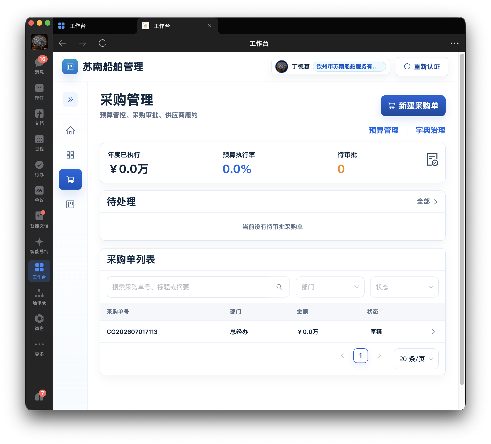

*图 7-1A 采购首页。截图应包含快捷入口、年度预算摘要、筛选和采购单列表。*

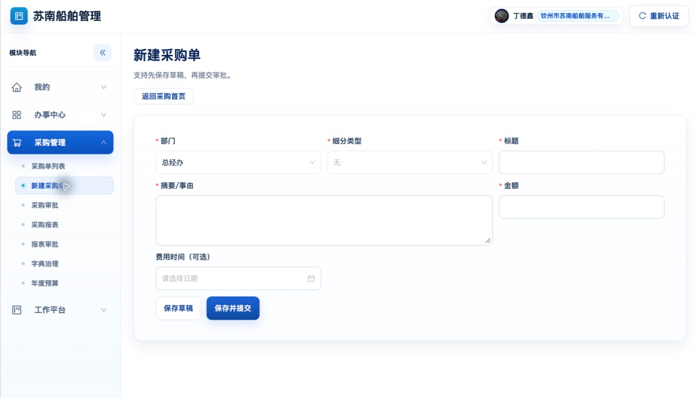

*图 7-1B-1 新建采购单。截图包含部门联动、细分对象、金额、费用日期时间控件和两个保存动作。*

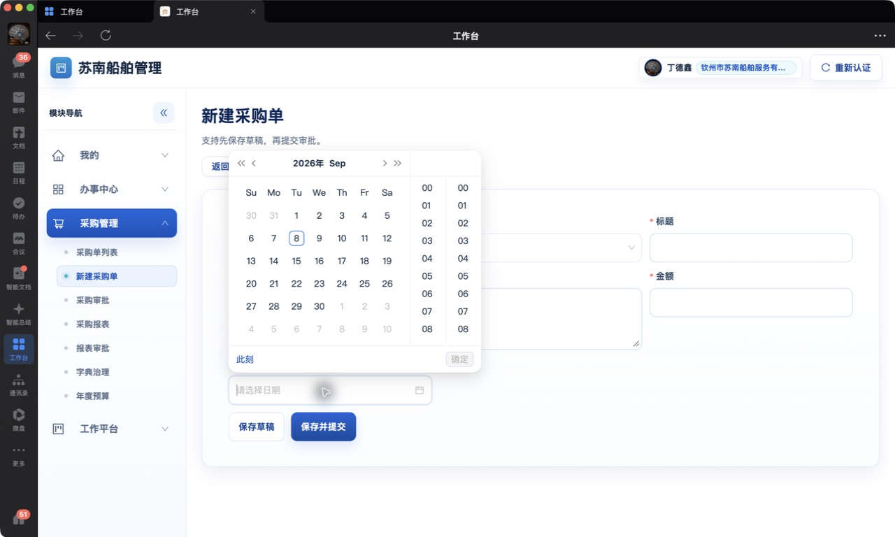

*图 7-1B-2 新建采购单日期选择器。截图展示费用日期时间控件的选择方式。*

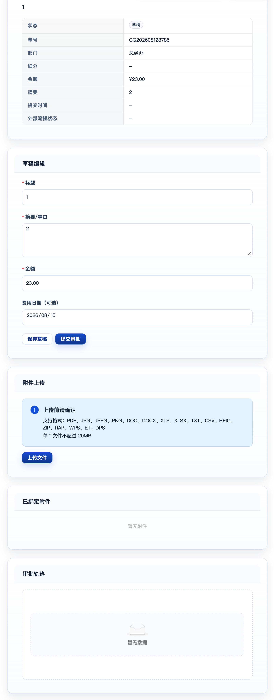

*图 7-1C 采购草稿详情。截图应包含草稿编辑、提交或重新提交。*

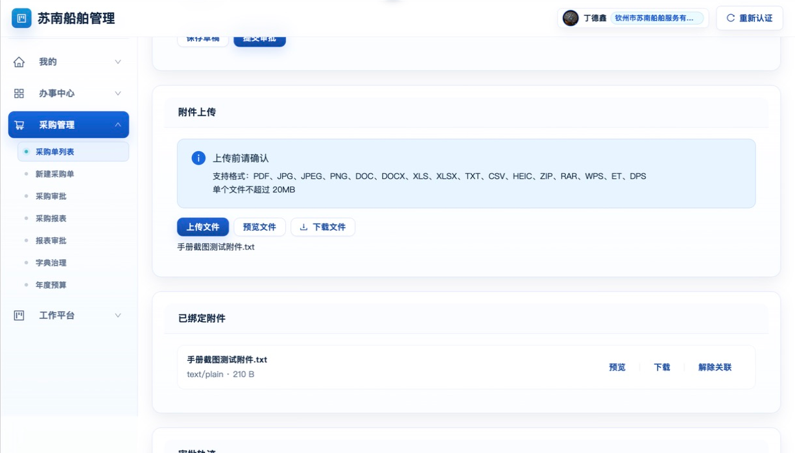

*图 7-1D 采购附件。截图应包含上传限制、预览、下载、解除和解除原因。*

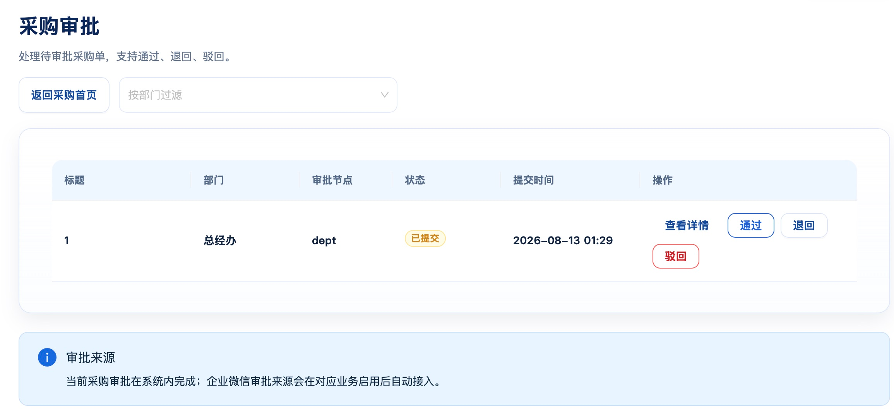

*图 7-2A 采购审批。截图应包含返回按钮、部门筛选、当前节点、审批意见和通过/退回/驳回。*

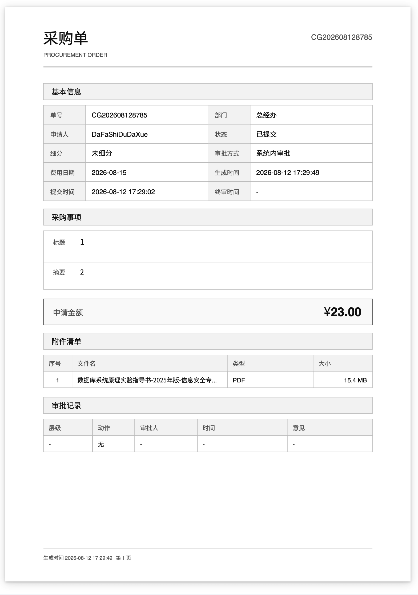

*图 7-2B 采购单 PDF 预览。截图应包含预览弹窗、采购单号、状态和审批轨迹。*

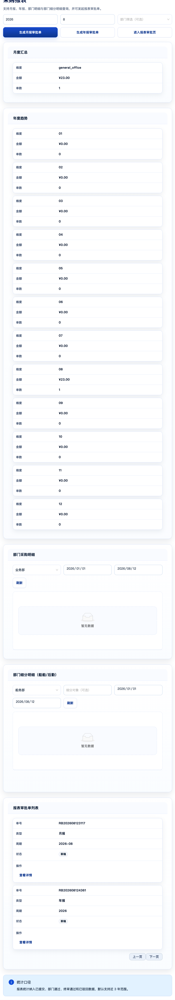

*图 7-3A 采购报表。截图应包含月报、年报、部门明细和船务/后勤细分明细。*

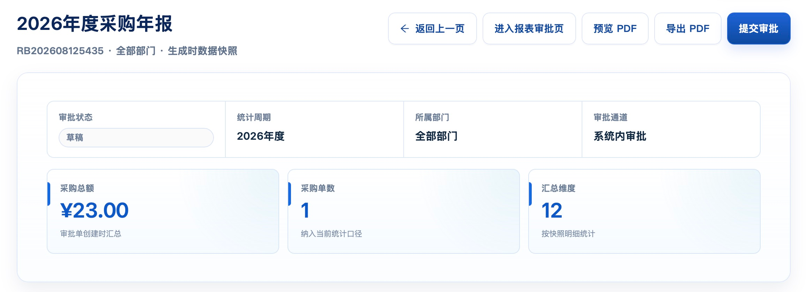

*图 7-3B 报表审批单业务摘要。截图应包含业务标题、状态概览、核心指标、参数和汇总明细。*

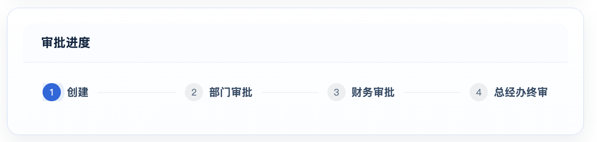

*图 7-3C 报表审批进度。截图应包含创建、部门审批、财务审批、总经办终审和审批记录。*

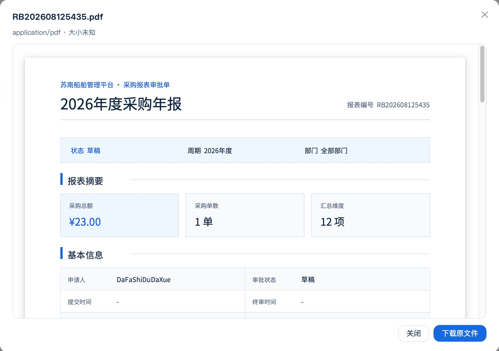

*图 7-3D 报表审批单 PDF 预览。截图应包含正式 A4 单据、数据快照说明和下载入口。*

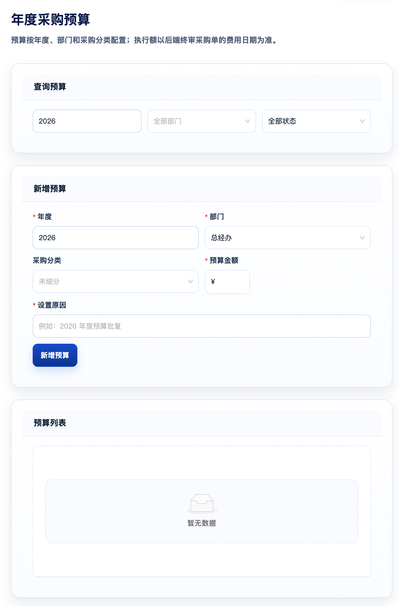

*图 7-4A 年度采购预算。截图应包含新增、执行率、调整和审计。*

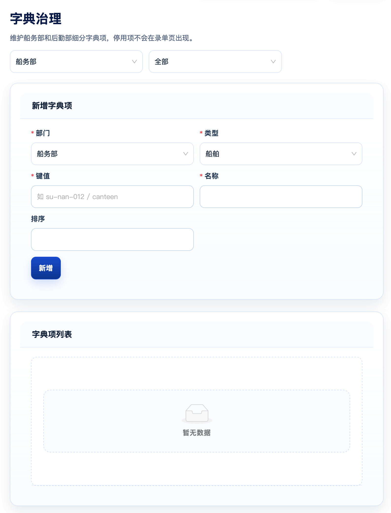

*图 7-4B 采购字典治理。截图应包含稳定键、名称、排序和停用。*

## 8. “工作平台”板块

### 8.1 工作平台定位

工作平台按部门和工作组承载动态业务模块、记录、审批、打印和考勤能力。用户看到的模块由角色、部门、船舶和配置决定。

工作平台首页集中显示：

- 当前待办；
- 待审批；
- 活跃模块；
- 本页记录；
- 部门模块卡片；
- 审批和异常提醒。

当前工作平台页头固定提供“考勤统计”和“审批看板”，侧边导航还提供海图更新、签到台、燃油加注审批等常用入口。入口是否显示由角色、部门和配置决定；普通用户不需要手工拼接地址。

### 8.2 模块总览

| 部门/工作组 | 当前主要模块 |
|---|---|
| 总经办 | 培训、会议、年度计划 |
| 财务部 | 考勤统计、财务业务板块 |
| 业务部 | 作业人员签到台、接收工作组流程、围油栏、签船记录、船舶动态、船舶垃圾、污油水、生活污水 |
| 船务部 | 培训学时、演练、值守、岸基叫应、船员会议、案例学习、考勤、设备维护、设备检验、航次审批、燃油加注、海图更新 |
| 后勤部 | 仓库、办公室、食堂、宿舍、车辆维修保养 |
| 工作组 | 中船工作组、平陆运河工作组作业闭环 |

旧的“业务操作流程”和“后勤资产服务”聚合模块只用于历史兼容，不再作为默认新建入口。

### 8.3 五类通用模板

| 模板 | 适用场景 | 典型动作 |
|---|---|---|
| 台账表单 | 培训、会议、年度计划、动态、海图更新 | 新建、附件、审批、打印 |
| 作业流程 | 接收作业、围油栏、垃圾/污水、工作组 | 开始、完成步骤、完工 |
| 考勤统计 | 财务/船务考勤 | 填报、月份筛选、统计明细 |
| 服务资产 | 仓库、办公、食堂、宿舍、车辆、设备 | 记录、维护、审批、统计 |
| 企业微信审批 | 航次、燃油等强审批业务 | 保存、发起原生审批、同步状态 |

### 8.4 打开模块和新建记录

1. 进入“工作平台”。
2. 点击目标部门模块卡片或快捷入口。
3. 系统直接进入该模块界面，并自动定位到模块记录列表；无需再手动向下滚动。
4. 任务看板默认完整展示两行模块卡片；点击标题右侧按钮可展开全部模块或收起为两行，当前已选模块始终固定排在第一项。
5. 查看模块说明、记录列表和状态，点击新建入口。
6. 填写记录标题。
7. 填写摘要说明。
8. 按需通过日期时间控件选择发生时间；所有日期字段都必须包含具体时间，不能填写日期字符串。
9. 使用受控下拉选择器选择船舶，列表只显示当前账号有权使用的有效船舶；不需要手工输入船舶 ID。
10. 填写模块动态字段。
11. 点击提交创建记录。

当前动态字段主要支持文本、数字、日期时间、状态选项和多行文本。日期时间字段统一使用控件选择并提交 ISO 日期时间，不再接受只填写日期。页面展示统一为上海时间 `YYYY-MM-DD HH:mm`，不显示 UTC 或时区后缀；移动端“最近记录”日期显示为 `MM-DD`，时间单独显示为 `HH:mm`。不要假定所有模块都有人员多选、签名、定位或复杂检查项。

### 8.5 台账表单

1. 新建台账记录。
2. 填写业务字段和附件。
3. 点击提交创建。
4. 在详情查看状态、附件和历史。
5. 按模块配置发起审批。
6. 生成 A4 或 A3 打印。

通用台账创建后可能仍是草稿，但当前前端不一定提供统一的二次“提交”按钮。以详情页实际动作区为准。

### 8.6 作业流程

业务部常见四步：

“班前会议 -> 作业前检查 -> 巡查记录 -> 完工确认”

工作组常见五步：

“班前会议 -> 工作考勤 -> 作业前检查 -> 巡航记录 -> 完工确认”

操作步骤：

1. 新建作业记录。
2. 打开详情。
3. 点击“开始”。
4. 完成当前步骤内容和现场资料。
5. 点击“完成步骤”。
6. 最后确认完工数据和状态。

### 8.7 考勤统计

1. 进入“考勤统计”，通过月份选择器选择月份，可进一步筛选可见部门。
2. 查看签到指标、模块记录数、人员汇总及考勤明细。月份和时间按上海时区计算。
3. 财务、总经办或系统管理员可点击“导出 Excel 明细”或“导出 PDF”；生成后点击“下载考勤报表”。失败时可重新生成。
4. Excel 包含“人员汇总”“逐日考勤”“考勤明细”三个工作表；导出范围与当前选择的月份、部门及账号可见数据一致。
5. 新增考勤或作业记录时登记实际工时，或同时填写作业开始、结束时间。填写起止时间时，系统优先按时间差计算工时。

没有登记人员或工时的历史记录会明确标记，不能当作零工时。只有姓名的历史记录按部门与姓名汇总，同名人员应通过明细核对。明细保留业务状态，提交、待审批与已审批记录可以区分；作废、终止或审批拒绝/撤销记录不计入本报表。

“钦州范围”以记录中的范围字段为准，没有填写范围的记录不归入范围内或范围外，不代表实时电子围栏。导出文件固定为发起时的数据快照，后续补录应重新导出。

### 8.8 企业微信审批类记录

1. 在工作平台创建业务记录。
2. 核对审批通道字段。
3. 点击“发起企业微信审批”。
4. 等待企业微信审批页打开。
5. 在原生审批页核对表单和审批人。
6. 提交审批。
7. 返回系统详情查看镜像状态和轨迹。

企业微信审批打不开时，不要连续发起。先在企业微信审批中心查找实例，再由管理员对账或重试。

### 8.9 培训、会议和年度计划

#### 培训与案例学习

总经办培训、船务培训学时和案例学习使用同一套个人学习流程：

1. 管理人员新建记录，填写学习主题、内容，并在详情上传需要学习的视频或文件。
2. 在“个人学习进度”中选择实际参训成员、填写每人完成学时，点击“下发学习”。成员首次登录本应用后才能出现在名单中。
3. 被分配的成员进入相应学习模块，打开自己的学习记录。阅读内容、打开材料后，逐项点击“确认已学习”。
4. 系统按该成员已确认的材料数自动计算进度；所有材料确认后计入完成学时。重复点击不会重复累计学时。
5. 管理人员查看每人进度、完成时间及课程完成率；“个人学习与学时统计”汇总已分配、已完成、完成率和完成学时，可导出 Excel。
6. 船务培训、案例学习全员完成后自动关闭；总经办培训全员完成后，由管理人员发起企业微信审批。普通成员只能确认自己的学习和查看自己的进度。

下发时冻结成员、材料与学时，不再使用手填整体百分比。需要新增材料或重新培训时创建新的学习记录。进度依据个人确认，不表示视频播放时长或考试成绩。历史台账不会自动推算个人完成情况，需要管理人员重新选择成员并下发。

#### 会议

登记会议主题、时间、地点、主持人、参会范围、纪要和附件。重要会议上传签到和照片，并按公司要求生成 A4/A3 归档。

#### 年度计划

登记年度、责任部门、节点、完成情况和附件，以详情页实际提供的保存、提交和打印动作完成记录。

### 8.10 航次审批、燃油加注和海图更新

#### 航次审批

1. 新建航次记录。
2. 在船舶下拉框中选择船舶；通过日期时间控件选择发生时间和预计离港时间，再填写航线及页面要求的业务字段。
3. 保存。
4. 发起企业微信审批。
5. 返回系统核对审批结果。

#### 燃油加注与月报

1. 新建加注申请，选择有效船舶，填写计划加注时间、油品、申请数量与原因，保存并发起企业微信审批。
2. 审批通过后，申请人或管理人员在详情的“实际加注登记”填写实际数量、计量单位和实际时间。申请数量不会自动当成实际加注量。
3. 在燃油模块的“燃油月报与余量”选择月份，登记该船舶、油品和单位的月末实测余量。首次使用且没有上月实测时，还需填写首次期初余量。
4. 系统自动承接上月实测作为期初，按“期初余量 + 本月实际加注 − 月末实测余量”计算月耗。升和吨分别统计，不作隐含换算。
5. 可按相同单位设置低余量提醒值；实测余量小于或等于该值时，月报显示提醒。
6. 点击“更正测量”回填已有数据后修改。保存时未提供的期初值和提醒值会保留；实际加注可在原申请详情更正，变更保留操作记录。
7. 点击“导出燃油月报”，下载月报、实际加注明细及待登记实绩清单。

缺少期初、缺少月末实测、计算出现负油耗或当月仍有已批准但未登记实绩的申请时，系统显示“待核对”，不编造月耗。当前月份应随实绩和测量及时更新；正式归档前补齐当月所有记录。旧台账手填的月油耗不会当成自动计算依据。低余量提示显示在月报页面，本功能不宣称已有仪表自动采集或企业微信推送。

#### 海图更新

1. 从快捷入口进入海图更新。
2. 新建记录。
3. 填写更新批次、适用船舶、版本/日期、说明等页面字段。
4. 上传附件。
5. 保存并查看详情或打印。

新版截图替换和新增位置见 [2026-09-20 截图更新清单](2026-09-20-截图更新清单.md)。

### 8.11 通用工作平台附件和打印

记录详情可能提供：

- 附件上传和列表；
- 企业微信拍照；
- 手写签名；
- 定位和人工异常说明；
- 打印 A4/A3；
- 生成打印快照；

按钮仍以当前记录的可用动作为准。无权用户不应看到文件名和下载地址。

已绑定工作台附件使用统一列表，可预览 PDF、图片、HEIC、TXT、CSV，其他允许格式可下载。拍照、上传、签名或定位完成后，仍需按页面提示保存或关联到当前记录。

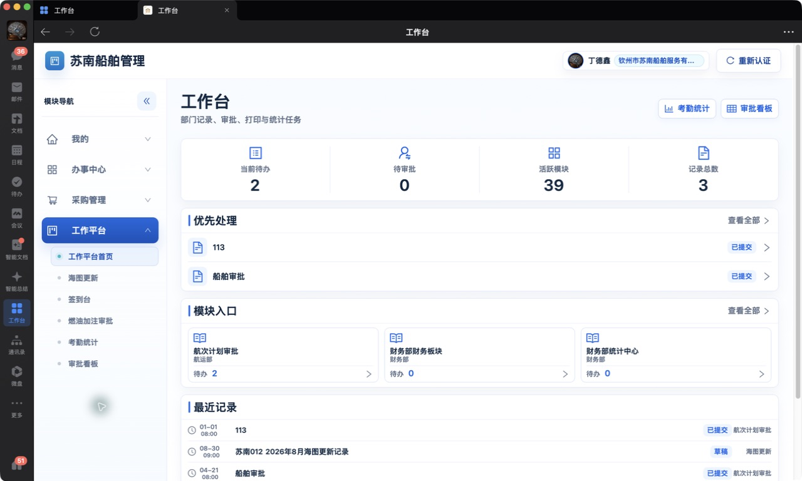

*图 8-1A-1 工作平台首页。截图包含待办、待审批、部门模块和固定快捷入口。*

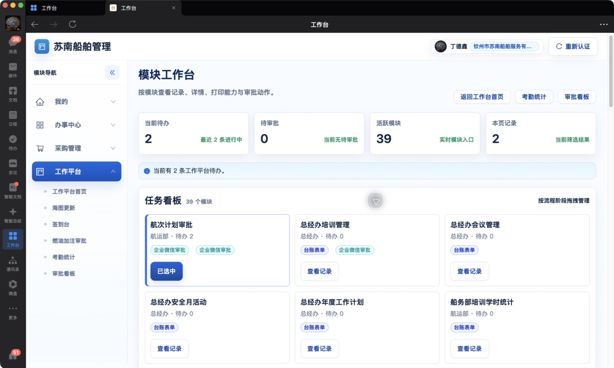

*图 8-1A-2 工作平台任务看板。截图包含任务看板展开状态、当前选中模块和模块入口。*

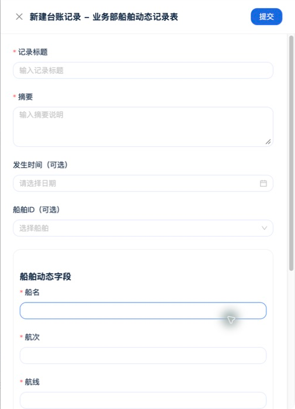

*图 8-1B-1 通用记录表单。截图包含标题、摘要、日期时间控件和船舶下拉框。*

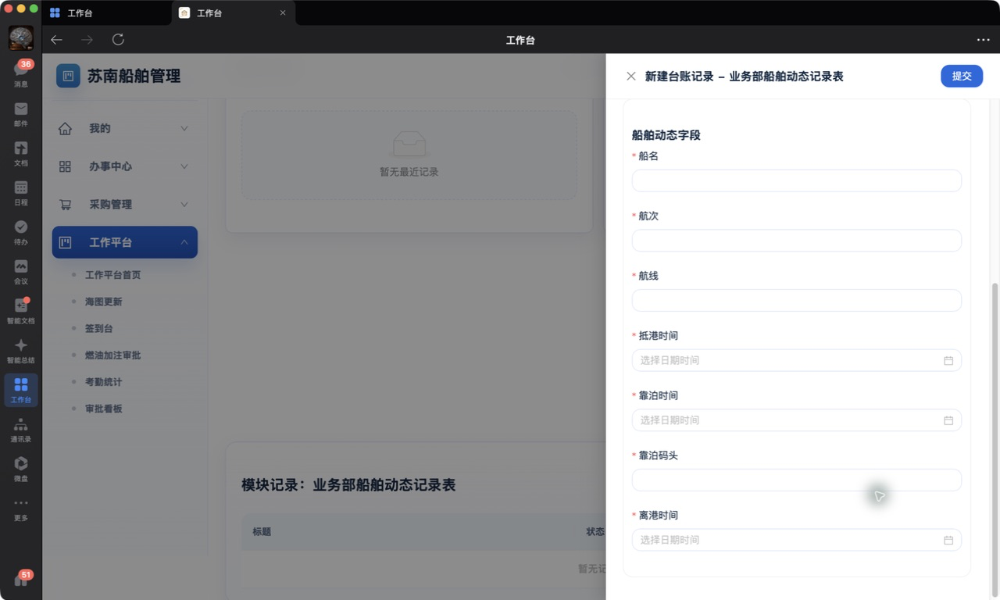

*图 8-1B-2 通用记录表单动态字段。截图展示模块动态字段的填写区域。*

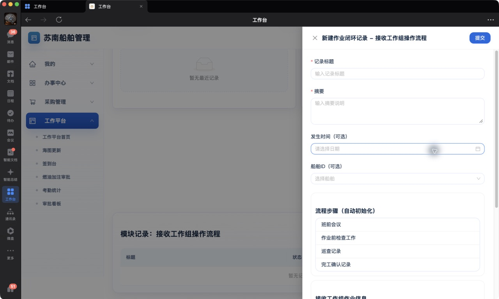

*图 8-1C-1 作业流程新建表单。截图展示日期时间、船舶下拉控件和自动初始化的流程步骤。*

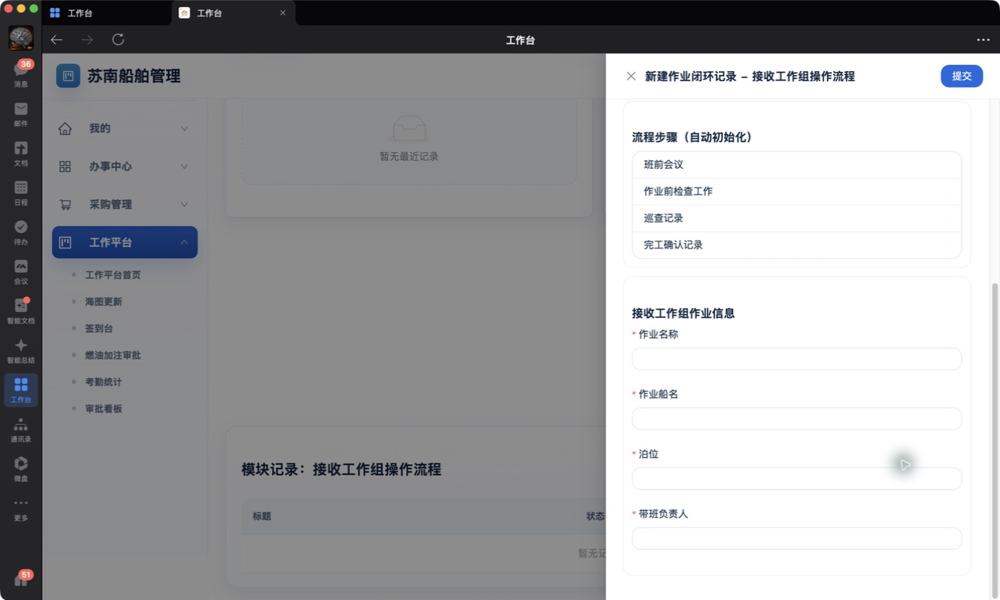

*图 8-1C-2 作业流程步骤及作业信息。截图展示步骤状态和对应作业信息。*

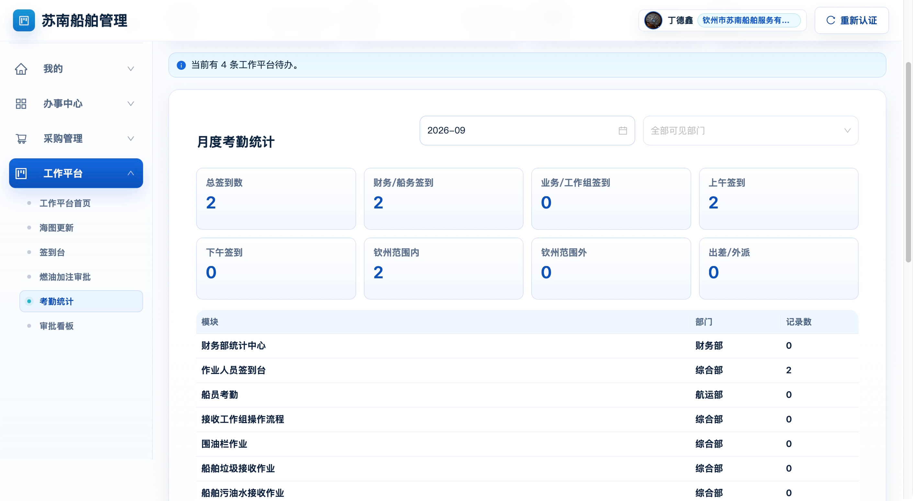

*图 8-1D 考勤统计（待按新版重拍）。新版应包含月份、部门筛选、导出入口、人员汇总和考勤明细；时间为上海时间。*

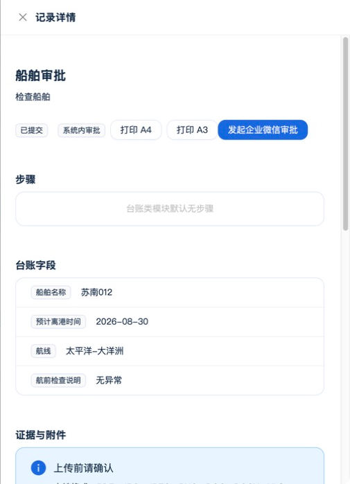

*图 8-1E 企业微信审批记录列表。截图展示审批标题、状态、审批通道和发生时间；发生时间显示为上海时间 `YYYY-MM-DD HH:mm`。*

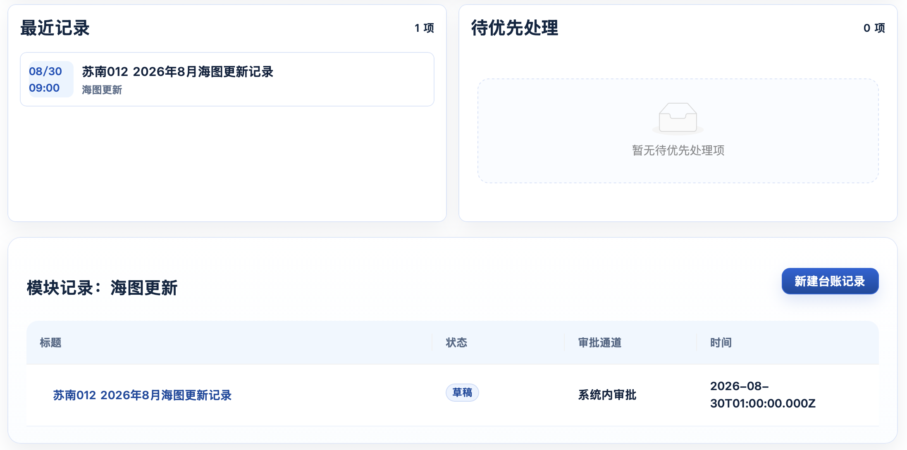

*图 8-1F 海图更新记录列表。截图展示最近记录、待优先处理区和新建台账记录入口。*

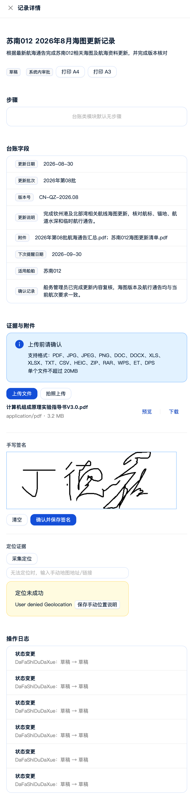

*图 8-1G 通用附件面板。截图应包含上传限制、拍照、附件预览/下载、签名和定位。*

## 9. 按角色快速操作清单

### 9.1 普通员工

- 从企业微信工作台进入；
- 查看本人证照提醒；
- 使用已发布办事入口；
- 创建本人有权的采购单；
- 查看本人相关待办；
- 不处理无权数据。

### 9.2 采购申请人

1. 新建采购并保存草稿。
2. 到详情上传附件。
3. 核对金额和费用日期。
4. 提交审批。
5. 根据退回/驳回意见修改。
6. 终审通过后下载 PDF。

### 9.3 采购审批人

1. 进入采购审批或报表审批。
2. 只处理当前节点待办。
3. 查看详情和附件。
4. 填写可追溯意见。
5. 通过、退回或驳回。
6. 刷新确认节点已经流转。

### 9.4 系统管理员

- 检查企业微信身份和角色映射；
- 处理办事治理、预算、字典和模块配置；
- 处理审批对账和失败重试；
- 检查文件、导出和下载授权；
- 保留异常编号、请求时间和审计记录。

## 10. 管理员与支持人员日常检查

### 10.1 每日检查

- 系统健康和企业微信认证；
- 关键工作台入口；
- 审批回调和对账异常；
- 文件上传、预览和导出失败；
- 无权限和数据范围投诉。

### 10.2 每周检查

- 用户部门、岗位和角色映射；
- 证照到期和提醒确认情况；
- 办事外部链接有效性；
- 采购字典停用项和预算执行率；
- 失败消息、导出是否完成补偿。

### 10.3 审批异常处理

1. 在企业微信审批中心查找实例。
2. 核对系统记录是否已有审批实例 ID。
3. 核对审批通道。
4. 查看回调、对账和重试记录。
5. 只对失败或可重试实例执行重试。
6. 不重复发起相同审批。

### 10.4 权限异常处理

1. 记录账号、角色、部门、船舶、页面和时间。
2. 立即停止传播无权数据。
3. 核对企业微信通讯录。
4. 核对记录所属部门、船舶和业务范围。
5. 修复后使用不同角色账号回归。

## 11. 常见问题与排障

### 11.1 一直停在“正在跳转企业微信授权”

- 确认在企业微信工作台内打开；
- 检查网络；
- 不要在普通浏览器直接打开生产入口；
- 关闭当前 H5 后从工作台重进；
- 仍失败时记录完整地址和时间。

### 11.2 重新认证后没有回到原页面

- 检查原链接是否为系统站内地址；
- 外部或异常目标会回到 /my；
- 从企业微信消息重新点击；
- 记录原业务编号联系管理员。

### 11.3 页面提示无权限

- 确认企业微信账号；
- 点击重新认证；
- 确认部门、岗位或所属船舶；
- 确认本人仍有该记录的处理权限；
- 联系管理员，不要转发链接给无权账号测试。

### 11.4 保存后列表没有记录

- 清空筛选；
- 检查日期范围和分页；
- 返回模块重新进入；
- 查看是否保存为草稿；
- 先搜索标题，确认未重复创建。

### 11.5 按钮突然消失

可能原因：

- 记录已被他人处理；
- 状态已经变化；
- 权限或数据范围变化；
- 详情刷新后 availableActions 已更新。

先刷新详情和轨迹，不要通过返回旧页面继续操作。

### 11.6 上传失败

- 检查格式和大小；
- 检查网络；
- 重新选择同一文件；
- 使用原上传项重试；
- 企业微信拍照不可用时改用上传文件；
- 不要把失败占位当成已绑定附件。

### 11.7 文件无法预览

- 先核对文件类型：Office/WPS 和压缩包只提供信息与下载，不直接展示内容；
- PDF、图片、HEIC、TXT、CSV 预览失败时，关闭弹窗后重新点击“预览”；
- 重新打开详情以获取新的短时授权地址；
- 检查是否仍有记录权限；
- 预览仍失败时使用弹窗中的下载入口保存原文件；
- 记录文件名和业务编号联系管理员。

### 11.8 采购单缺少附件

当前新建页没有附件控件。正确流程是“保存草稿 -> 进入详情 -> 上传并绑定 -> 提交审批”。

### 11.9 采购审批没有打开企业微信

这是当前设计：采购单和采购报表默认走系统内审批。请进入采购审批或报表审批页面处理。

### 11.10 企业微信审批页没有打开

此问题只针对工作平台原生审批业务：

- 确认企业微信 JS-SDK 已就绪；
- 不连续点击发起；
- 去企业微信审批中心查找；
- 管理员检查审批实例、回调和对账。

### 11.11 PDF 没有下载

- 确认状态满足打印条件；
- 检查是否仍在 queued/running；
- 查看是否生成真实文件；
- failed 时查看原因并重试；
- “预览 PDF”会在系统弹窗中打开，“导出 PDF”才会开始下载；
- 浏览器阻止下载时，允许当前站点下载后再次点击“导出 PDF”；
- 记录编号和生成时间交管理员查询。

### 11.12 看板与列表数字不一致

- 确认筛选范围、角色和时间；
- 看板和列表可能使用不同业务口径；
- 正式审计以受权列表、详情、轨迹和导出为准；
- 若同一口径仍不一致，记录筛选条件和时间。

### 11.13 附件删除后 OSS 空间未下降

- 先确认附件已经从当前业务移除；失败时按提示重试，不要删除整个存储目录。
- 未满 24 小时、仍被其他业务或历史证据引用时，不会回收。
- 管理员检查后台回收队列、删除权限和存储连接；失败任务会自动重试。
- 存储桶开启版本控制或保留策略时，历史版本可能仍计费，需由管理员配置生命周期。
