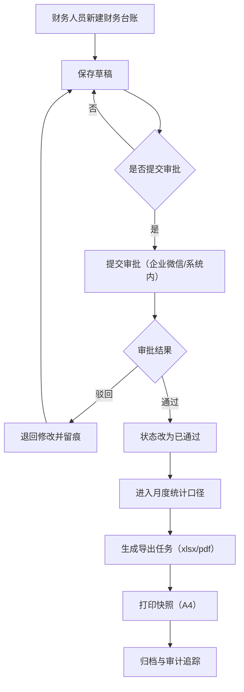

# 财务板块流程图（M6 Wave C 自生成补料基线）

## 1. 说明
- 生成日期：2026-04-22
- 适用模块：`finance_business_board`
- 范围：提单 -> 审批 -> 统计 -> 导出 -> 打印归档

## 2. 流程图

## 3. 角色职责
- 财务录单人：创建、编辑、提交。
- 财务审核人：审批通过/驳回。
- 管理员：统计导出、打印、归档审计。

